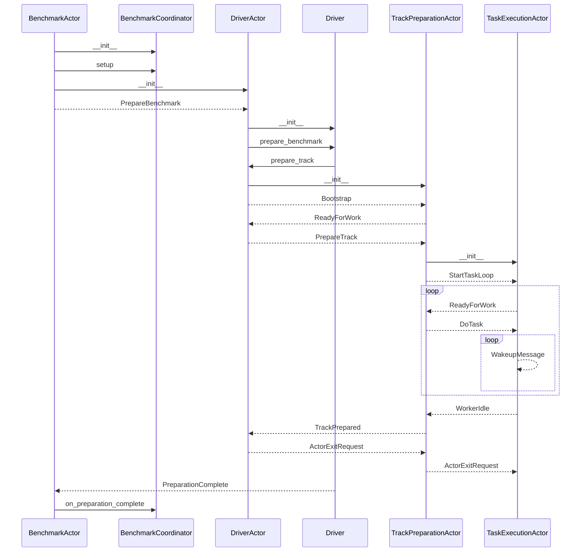
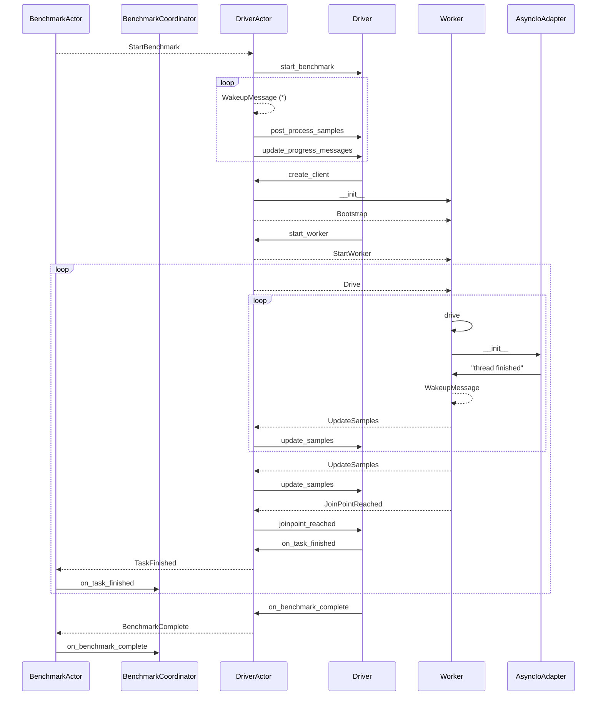

# Rally Actor System

At its heart, Rally is a distributed system. It has been designed that way to
allow using both multiple target hosts and load drivers in the same benchmark.
The latter ensures that Rally is never a bottleneck. In the vast majority of
cases, using a powerful load driver is enough, but benchmarking large
Elasticsearch clusters containing tens or hundreds of nodes can require more
load drivers.

## Thespian

Actors are managed by [Thespian](https://thespianpy.com/doc/) which provide us
with the following features:

 * Works with Linux and macOS (and Windows, though Rally does not support Windows)
 * Handles the communication between actors regardless of their locations
 * Scales from running Rally and Elasticsearch on one workstation to
   benchmarking large Elasticsearch clusters with multiple load drivers,
   without any change to the Rally codebase.

While it is not without its rough edges, it is [well
documented](https://thespianpy.com/doc/using.html) and battle tested.
Additionally, the maintainer has always been responsive and helpful.

## Sequence diagrams

Rally has a number of actors that all inherit from `actor.RallyActor`. This
document focuses on the actors needed to *prepare* and *run* a benchmark, with
the following limitations:

 * The mechanic actors that can set up an Elasticsearch cluster are not covered
 * Failure and cancellation are ignored, this is about the happy path
 * This pretends that we are benchmarking on a single machine with a single
   core.

The sequence diagram below starts with `BenchmarkActor` defined in
`racecontrol.py` which does the high-level scheduling:

 * Setup the Elasticsearch cluster if the pipeline requires it (not covered
   here)
 * Prepare the benchmark which involves the `TrackPreparationActor` and
   `TaskExecutionActor` actors.
 * Start the benchmark, which will involve the `Worker` actor that will
   delegate the actual work to `AsyncIoAdapter`, which will run an asyncio loop
   in a thread, which is how `AsyncExecutor` runs many Elasticsearch async
   clients.

You'll notice that `DriverActor` and `Driver` are tightly coupled. While
`Driver` contains most of the logic, it is not an actor, so it relies on
`DriverActor` to send and receive messages. This was done mainly to enable
`Driver` unit testing without bringing the actor system up.

### PrepareBenchmark

Here's the sequence diagram for benchmark preparation. Dotted lines
mean messages sent with the actor systems, while plain lines are
function calls.

### StartBenchmark

Once the preparation is complete, `BenchmarkActor` starts the
benchmark. As above, dotted lines means messages sent with the actor
systems, while plain lines are function calls.

Note: The `WakeupMessage` loop in `DriverActor` denoted with `(*)` continues in
parallel until all steps of the benchmark are done but it is kept short in the
diagram for clarity.

