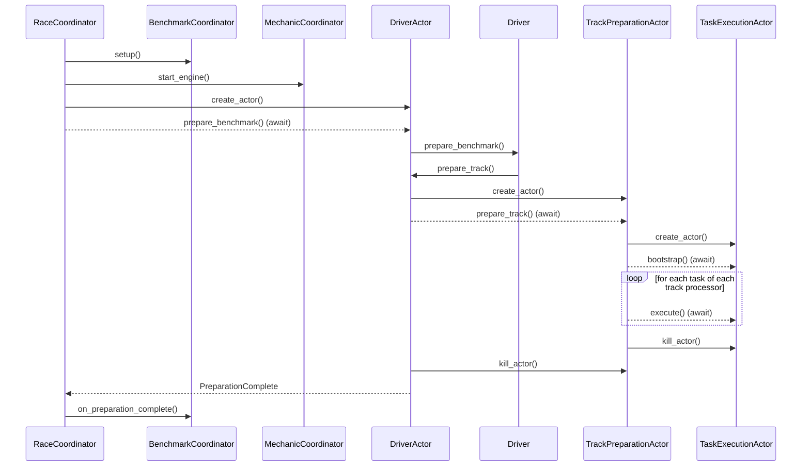
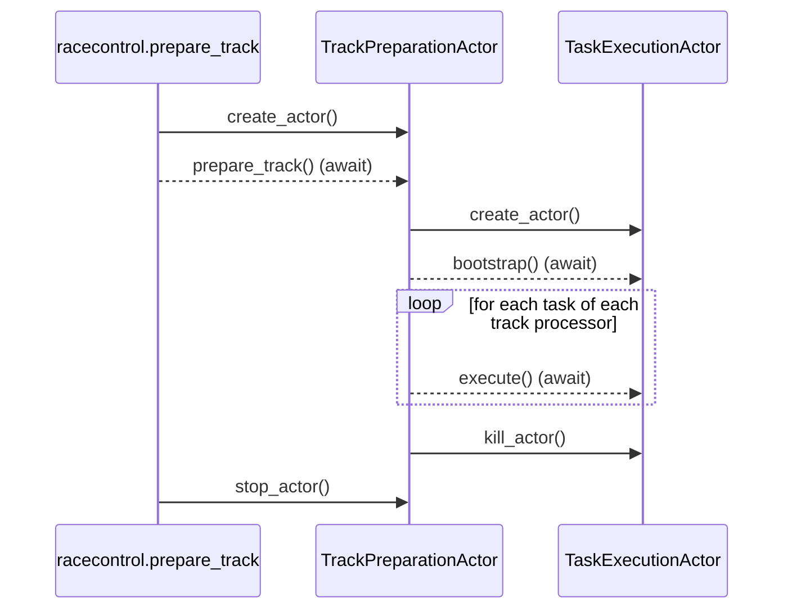
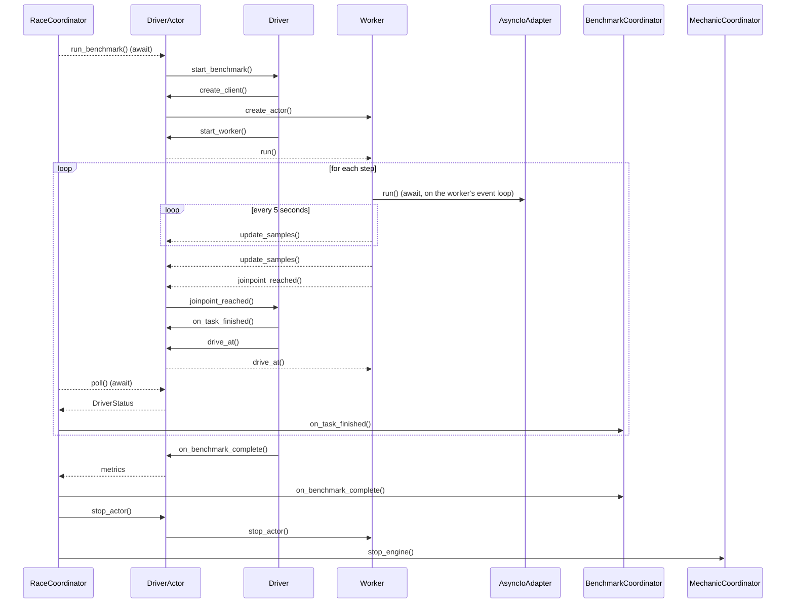

# Rally Actor System

At its heart, Rally is a distributed system. It has been designed that way to
allow using both multiple target hosts and load drivers in the same benchmark.
The latter ensures that Rally is never a bottleneck. In the vast majority of
cases, using a powerful load driver is enough, but benchmarking large
Elasticsearch clusters containing tens or hundreds of nodes can require more
load drivers.

## Ray

Actors are managed by [Ray Core](https://docs.ray.io/en/latest/ray-core/walkthrough.html),
which provides us with the following features:

 * Works with Linux and macOS
 * Actors are processes that run on any node of a Ray cluster, which allows
   scaling from running Rally and Elasticsearch on one workstation to
   benchmarking large Elasticsearch clusters with multiple load drivers,
   without any change to the Rally codebase.
 * Calling an actor method returns a future (an `ObjectRef`) which can be
   awaited. Exceptions raised by actor methods are raised when awaiting the
   result.
 * Async actors run their methods on an asyncio event loop, which Rally's load
   generators use for their asyncio-based Elasticsearch clients.
 * Placing actors on specific nodes with node resources (`node:<ip>`).

When Rally runs on a single machine, `esrally` starts a local Ray instance which
only uses the loopback interface and stops it when it exits. On multiple
machines, `esrallyd` runs `ray start` to form a Ray cluster, see
`docs/rally_daemon.rst`.

## Conventions

`esrally/actor.py` contains Rally's thin layer on top of Ray:

 * Actors are plain Python classes deriving from `actor.RallyActorBase`.
   `actor.create_actor()` starts them as Ray actors, placed on a host.
   Unit tests instantiate actor classes directly, without Ray.
 * Parents pass their own handle (`self_handle`) to the children that need to
   call them. There is no implicit "sender".
 * Methods whose result is awaited use `@actor.convert_failures`: exceptions
   are raised as `actor.BenchmarkFailure` with a traceback as a string, because
   exception classes of track plugins might not be importable by the caller.
 * Fire-and-forget methods and background tasks use `@actor.report_failures`,
   which hands failures to the actor's `_fail()` method. Each actor decides how
   to surface them.
 * Actors are stopped explicitly with `actor.stop_actor()`, which calls their
   `stop()` method and kills them afterwards. Ray also kills actors when the
   actor or process that created them dies.

## Components

Race control (`racecontrol.RaceCoordinator`) and the mechanic coordinator
(`mechanic.MechanicCoordinator`) run in the `esrally` process, which owns the
user's terminal. They are not actors: they await the results of actor methods
and poll the `DriverActor` for progress. All other components are actors:

| Actor | Kind | Runs on | Role |
|---|---|---|---|
| `DriverActor` | async | coordinator | Coordinates workers. Thin wrapper around `Driver`. |
| `Worker` | async | load drivers | Runs the clients of a share of the benchmark on its event loop. |
| `TrackPreparationActor` | async | load drivers | Runs track processors, e.g. downloads data. |
| `TaskExecutionActor` | sync | load drivers | Runs one task of a track processor at a time. |
| `NodeMechanicActor` | async | target hosts | Starts and stops Elasticsearch nodes. |

You'll notice that `DriverActor` and `Driver` are tightly coupled. While
`Driver` contains most of the logic, it is not an actor, so it relies on
`DriverActor` to call other actors. This was done mainly to enable `Driver`
unit testing without bringing actors up.

## Sequence diagrams

This document focuses on the actors needed to *prepare* and *run* a benchmark,
with the following limitations:

 * The mechanic actors that can set up an Elasticsearch cluster are not covered
 * Failure and cancellation are covered in text only
 * This pretends that we are benchmarking on a single machine with a single
   core.

Dotted lines are actor method calls, plain lines are function calls. Calls
marked with `(await)` wait for the result.

### PrepareBenchmark

```mermaid
sequenceDiagram
    RaceCoordinator ->> BenchmarkCoordinator: setup()
    RaceCoordinator ->> MechanicCoordinator: start_engine()
    RaceCoordinator ->> DriverActor: create_actor()
    RaceCoordinator -->> DriverActor: prepare_benchmark() (await)
    DriverActor ->> Driver: prepare_benchmark()
    Driver ->> DriverActor: prepare_track()
    DriverActor ->> TrackPreparationActor: create_actor()
    DriverActor -->> TrackPreparationActor: prepare_track() (await)
    TrackPreparationActor ->> TaskExecutionActor: create_actor()
    TrackPreparationActor -->> TaskExecutionActor: bootstrap() (await)
    loop for each task of each track processor
        TrackPreparationActor -->> TaskExecutionActor: execute() (await)
    end
    TrackPreparationActor ->> TaskExecutionActor: kill_actor()
    DriverActor ->> TrackPreparationActor: kill_actor()
    DriverActor -->> RaceCoordinator: PreparationComplete
    RaceCoordinator ->> BenchmarkCoordinator: on_preparation_complete()
```

### PrepareTrackStandalone

A subset of benchmark preparation flow takes place when `esrally prepare-track`
command is used. In this case, `TrackPreparationActor` is created not from
`DriverActor` but directly from the main Rally process in
`racecontrol.prepare_track()`.

```mermaid
sequenceDiagram
    racecontrol.prepare_track ->> TrackPreparationActor: create_actor()
    racecontrol.prepare_track -->> TrackPreparationActor: prepare_track() (await)
    TrackPreparationActor ->> TaskExecutionActor: create_actor()
    TrackPreparationActor -->> TaskExecutionActor: bootstrap() (await)
    loop for each task of each track processor
        TrackPreparationActor -->> TaskExecutionActor: execute() (await)
    end
    TrackPreparationActor ->> TaskExecutionActor: kill_actor()
    racecontrol.prepare_track ->> TrackPreparationActor: stop_actor()
```

### RunBenchmark

Once the preparation is complete, `RaceCoordinator` runs the benchmark. While
waiting for `run_benchmark()` to complete, it polls the driver every second to
print progress and to store the metrics of finished tasks. In the meantime,
`DriverActor` runs a tick loop every second (not shown) that post-processes
samples, updates progress and checks that no worker has exited prematurely.

```mermaid
sequenceDiagram
    RaceCoordinator -->> DriverActor: run_benchmark() (await)
    DriverActor ->> Driver: start_benchmark()
    Driver ->> DriverActor: create_client()
    DriverActor ->> Worker: create_actor()
    Driver ->> DriverActor: start_worker()
    DriverActor -->> Worker: run()
    loop for each step
        Worker ->> AsyncIoAdapter: run() (await, on the worker's event loop)
        loop every 5 seconds
            Worker -->> DriverActor: update_samples()
        end
        Worker -->> DriverActor: update_samples()
        Worker -->> DriverActor: joinpoint_reached()
        DriverActor ->> Driver: joinpoint_reached()
        Driver ->> DriverActor: on_task_finished()
        Driver ->> DriverActor: drive_at()
        DriverActor -->> Worker: drive_at()
        RaceCoordinator -->> DriverActor: poll() (await)
        DriverActor -->> RaceCoordinator: DriverStatus
        RaceCoordinator ->> BenchmarkCoordinator: on_task_finished()
    end
    Driver ->> DriverActor: on_benchmark_complete()
    DriverActor -->> RaceCoordinator: metrics
    RaceCoordinator ->> BenchmarkCoordinator: on_benchmark_complete()
    RaceCoordinator ->> DriverActor: stop_actor()
    DriverActor ->> Worker: stop_actor()
    RaceCoordinator ->> MechanicCoordinator: stop_engine()
```

### Failures and cancellation

 * `Worker.run()` only returns when the worker is stopped. If a worker fails,
   `run()` raises `BenchmarkFailure`; if its process dies, awaiting `run()`
   raises a Ray error. `DriverActor` checks this in its tick loop and fails the
   benchmark, so `run_benchmark()` raises `BenchmarkFailure`.
 * `RaceCoordinator` turns `BenchmarkFailure` into a `RallyError` for the
   user, and always stops the driver and the engine.
 * On Ctrl-C, `actor.run_async()` cancels race control's coroutine.
   `RaceCoordinator` then calls `DriverActor.cancel()`, which stops all workers,
   and stops the driver and the engine. A second Ctrl-C interrupts this
   clean-up; Ray stops the remaining actors when `esrally` disconnects.
