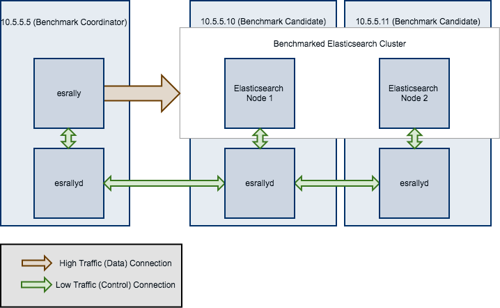

Tips and Tricks
===============

This section covers various tips and tricks in a recipe-style fashion.

Benchmarking an existing cluster
--------------------------------

.. warning::

    If you are just getting started with Rally and don't understand how it works, do NOT run it against any production or production-like cluster. Besides, benchmarks should be executed in a dedicated environment anyway where no additional traffic skews results.

.. note::

    We assume in this recipe, that Rally is already properly :doc:`configured </configuration>`.

Consider the following configuration: You have an existing benchmarking cluster, that consists of three Elasticsearch nodes running on ``10.5.5.10``, ``10.5.5.11``, ``10.5.5.12``. You've setup the cluster yourself and want to benchmark it with Rally. Rally is installed on ``10.5.5.5``.

.. image:: benchmark_existing.png
   :alt: Sample Benchmarking Scenario

First of all, we need to decide on a track. So, we run ``esrally list tracks``::

    Name        Description                                          Documents  Compressed Size    Uncompressed Size    Default Challenge        All Challenges
    ----------  -------------------------------------------------  -----------  -----------------  -------------------  -----------------------  ---------------------------
    geonames    POIs from Geonames                                    11396505  252.4 MB           3.3 GB               append-no-conflicts      append-no-conflicts,appe...
    geopoint    Point coordinates from PlanetOSM                      60844404  481.9 MB           2.3 GB               append-no-conflicts      append-no-conflicts,appe...
    http_logs   HTTP server log data                                 247249096  1.2 GB             31.1 GB              append-no-conflicts      append-no-conflicts,appe...
    nested      StackOverflow Q&A stored as nested docs               11203029  663.1 MB           3.4 GB               nested-search-challenge  nested-search-challenge,...
    noaa        Global daily weather measurements from NOAA           33659481  947.3 MB           9.0 GB               append-no-conflicts      append-no-conflicts,appe...
    nyc_taxis   Taxi rides in New York in 2015                       165346692  4.5 GB             74.3 GB              append-no-conflicts      append-no-conflicts,appe...
    percolator  Percolator benchmark based on AOL queries              2000000  102.7 kB           104.9 MB             append-no-conflicts      append-no-conflicts,appe...
    pmc         Full text benchmark with academic papers from PMC       574199  5.5 GB             21.7 GB              append-no-conflicts      append-no-conflicts,appe...

We're interested in a full text benchmark, so we'll choose to run ``pmc``. If you have your own data that you want to use for benchmarks :doc:`create your own track</adding_tracks>` instead; the metrics you'll gather will be more representative and useful than some default track.

Next, we need to know which machines to target which is easy as we can see that from the diagram above.

Finally we need to check which :doc:`pipeline </pipelines>` to use. For this case, the ``benchmark-only`` pipeline is suitable as we don't want Rally to provision the cluster for us.

Now we can invoke Rally::

    esrally --track=pmc --target-hosts=10.5.5.10:9200,10.5.5.11:9200,10.5.5.12:9200 --pipeline=benchmark-only

If you have `X-Pack Security <https://www.elastic.co/products/x-pack/security>`_  enabled, then you'll also need to specify another parameter to use https and to pass credentials::

    esrally --track=pmc --target-hosts=10.5.5.10:9243,10.5.5.11:9243,10.5.5.12:9243 --pipeline=benchmark-only --client-options="use_ssl:true,verify_certs:true,basic_auth_user:'elastic',basic_auth_password:'changeme'"

.. _recipe_benchmark_remote_cluster:

Benchmarking a remote cluster
-----------------------------

Contrary to the previous recipe, you want Rally to provision all cluster nodes.

We will use the following configuration for the example:

* You will start Rally on ``10.5.5.5``. We will call this machine the "benchmark coordinator".
* Your Elasticsearch cluster will consist of two nodes which run on ``10.5.5.10`` and ``10.5.5.11``. We will call these machines the "benchmark candidate"s.

.. note::

   All ``esrallyd`` nodes form a cluster that communicates via the "benchmark coordinator". For aesthetic reasons we do not show a direct connection between the "benchmark coordinator" and all nodes.

To run a benchmark for this scenario follow these steps:

1. :doc:`Install </install>` and :doc:`configure </configuration>` Rally on all machines. Be sure that the same version is installed on all of them and fully :doc:`configured </configuration>`.
2. Start the :doc:`Rally daemon </rally_daemon>` on each machine. The Rally daemon allows Rally to communicate with all remote machines. On the benchmark coordinator run ``esrallyd start --node-ip=10.5.5.5 --coordinator-ip=10.5.5.5`` and on the benchmark candidate machines run ``esrallyd start --node-ip=10.5.5.10 --coordinator-ip=10.5.5.5`` and ``esrallyd start --node-ip=10.5.5.11 --coordinator-ip=10.5.5.5`` respectively. The ``--node-ip`` parameter tells Rally the IP of the machine on which it is running. As some machines have more than one network interface, Rally will not attempt to auto-detect the machine IP. The ``--coordinator-ip`` parameter tells Rally the IP of the benchmark coordinator node.
3. Start the benchmark by invoking Rally as usual on the benchmark coordinator, for example: ``esrally --distribution-version=5.0.0 --target-hosts=10.5.5.10:9200,10.5.5.11:9200``. Rally will derive from the ``--target-hosts``  parameter that it should provision the nodes ``10.5.5.10`` and ``10.5.5.11``.
4. After the benchmark has finished you can stop the Rally daemon again. On the benchmark coordinator and on the benchmark candidates run ``esrallyd stop``.

.. note::

   Logs are managed per machine, so all relevant log files and also telemetry output is stored on the benchmark candidates but not on the benchmark coordinator.

Now you might ask yourself what the differences to benchmarks of existing clusters are. In general you should aim to give Rally as much control as possible as benchmark are easier reproducible and you get more metrics. The following table provides some guidance on when to choose which option:

===================================================== =========================================================================================================================================================
Your requirement                                      Recommendation
===================================================== =========================================================================================================================================================
You want to use Rally's telemetry devices             Use Rally daemon, as it can provision the remote node for you
You want to benchmark a source build of Elasticsearch Use Rally daemon, as it can build Elasticsearch for you
You want to tweak the cluster configuration yourself  Use Rally daemon with a :doc:`custom configuration </car>` or set up the cluster by yourself and use ``--pipeline=benchmark-only``
You need to run a benchmark with plugins              Use Rally daemon if the :doc:`plugins </elasticsearch_plugins>` are supported or set up the cluster by yourself and use ``--pipeline=benchmark-only``
You need to run a benchmark against multiple nodes    Use Rally daemon if all nodes can be configured identically. For more complex cases, set up the cluster by yourself and use ``--pipeline=benchmark-only``
===================================================== =========================================================================================================================================================

Rally daemon will be able to cover most of the cases described above in the future so there should be almost no case where you need to use the ``benchmark-only`` pipeline.

.. _recipe_distributed_load_driver:

Distributing the load test driver
---------------------------------

By default, Rally will generate load on the same machine where you start a benchmark. However, when you are benchmarking larger clusters, a single load test driver machine may not be able to generate sufficient load. In these cases, you should use multiple load driver machines. We will use the following configuration for the example:

* You will start Rally on ``10.5.5.5``. We will call this machine the "benchmark coordinator".
* You will start two load drivers on ``10.5.5.6`` and ``10.5.5.7``. Note that one load driver will simulate multiple clients. Rally will simply assign clients to load driver machines in a round-robin fashion.
* Your Elasticsearch cluster will consist of three nodes which run on ``10.5.5.11``, ``10.5.5.12`` and ``10.5.5.13``. We will call these machines the "benchmark candidate". For simplicity, we will assume an externally provisioned cluster but you can also use Rally to setup the cluster for you (see above).

1. :doc:`Install </install>` and :doc:`configure </configuration>` Rally on all machines. Be sure that the same version is installed on all of them and fully :doc:`configured </configuration>`.
2. Start the :doc:`Rally daemon </rally_daemon>` on each machine. The Rally daemon allows Rally to communicate with all remote machines. On the benchmark coordinator run ``esrallyd start --node-ip=10.5.5.5 --coordinator-ip=10.5.5.5`` and on the load driver machines run ``esrallyd start --node-ip=10.5.5.6 --coordinator-ip=10.5.5.5`` and ``esrallyd start --node-ip=10.5.5.7 --coordinator-ip=10.5.5.5`` respectively. The ``--node-ip`` parameter tells Rally the IP of the machine on which it is running. As some machines have more than one network interface, Rally will not attempt to auto-detect the machine IP. The ``--coordinator-ip`` parameter tells Rally the IP of the benchmark coordinator node.
3. Start the benchmark by invoking Rally on the benchmark coordinator, for example: ``esrally --pipeline=benchmark-only --load-driver-hosts=10.5.5.6,10.5.5.7 --target-hosts=10.5.5.11:9200,10.5.5.12:9200,10.5.5.13:9200``.
4. After the benchmark has finished you can stop the Rally daemon again. On the benchmark coordinator and on the load driver machines run ``esrallyd stop``.

.. note::

   Rally neither distributes code (i.e. :ref:`custom runners <adding_tracks_custom_runners>` or :ref:`parameter sources <adding_tracks_custom_param_sources>`) nor data automatically. You should place all tracks and their data on all machines in the same directory before starting the benchmark. Alternatively, you can store your track in a custom track repository.

.. note::

   As indicated in the diagram, track data will be downloaded by each load driver machine separately. If you want to avoid that, you can run a benchmark once without distributing the load test driver (i.e. do not specify ``--load-driver-hosts``) and then copy the contents of ``~/.rally/benchmarks/data`` to all load driver machines.

Changing the default track repository
-------------------------------------

Rally supports multiple track repositories. This allows you for example to have a separate company-internal repository for your own tracks that is separate from `Rally's default track repository <https://github.com/elastic/rally-tracks>`_. However, you always need to define ``--track-repository=my-custom-repository`` which can be cumbersome. If you want to avoid that and want Rally to use your own track repository by default you can just replace the default track repository definition in ``~./rally/rally.ini``. Consider this example::

    ...
    [tracks]
    default.url = git@github.com:elastic/rally-tracks.git
    teamtrackrepo.url = git@example.org/myteam/my-tracks.git

If ``teamtrackrepo`` should be the default track repository, just define it as ``default.url``. E.g.::

    ...
    [tracks]
    default.url = git@example.org/myteam/my-tracks.git
    old-rally-default.url=git@github.com:elastic/rally-tracks.git

Also don't forget to rename the folder of your local working copy as Rally will search for a track repository with the name ``default``::

    cd ~/.rally/benchmarks/tracks/
    mv default old-rally-default
    mv teamtrackrepo default

From now on, Rally will treat your repository as default and you need to run Rally with ``--track-repository=old-rally-default`` if you want to use the out-of-the-box Rally tracks.
