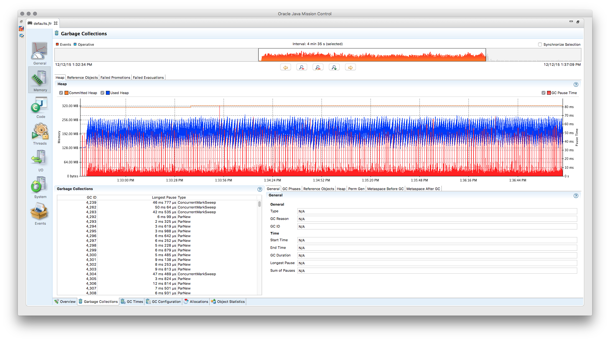

Telemetry Devices
=================

You probably want to gain additional insights from a race. Therefore, we have added telemetry devices to Rally.

.. warning::

   Keep in mind that each telemetry device may incur a runtime overhead which can skew results.

If you invoke ``esrally list telemetry``, it will show which telemetry devices are available::

   $ esrally list telemetry

       ____        ____
      / __ \____ _/ / /_  __
     / /_/ / __ `/ / / / / /
    / _, _/ /_/ / / / /_/ /
   /_/ |_|\__,_/_/_/\__, /
                   /____/

   Available telemetry devices:

   Command                     Name                        Description
   --------------------------  --------------------------  --------------------------------------------------------------------
   jit                         JIT Compiler Profiler       Enables JIT compiler logs.
   gc                          GC log                      Enables GC logs.
   jfr                         Flight Recorder             Enables Java Flight Recorder (requires an Oracle JDK or OpenJDK 11+)
   heapdump                    Heap Dump                   Captures a heap dump.
   node-stats                  Node Stats                  Regularly samples node stats
   recovery-stats              Recovery Stats              Regularly samples shard recovery stats
   ccr-stats                   CCR Stats                   Regularly samples Cross Cluster Replication (CCR) related stats
   segment-stats               Segment Stats               Determines segment stats at the end of the benchmark.
   transform-stats             Transform Stats             Regularly samples transform stats
   searchable-snapshots-stats  Searchable Snapshots Stats  Regularly samples searchable snapshots stats
   shard-stats                 Shard Stats                 Regularly samples nodes stats at shard level
   data-stream-stats           Data Stream Stats           Regularly samples data stream stats
   ingest-pipeline-stats       Ingest Pipeline Stats       Reports Ingest Pipeline stats at the end of the benchmark.
   disk-usage-stats            Disk usage of each field    Runs the indices disk usage API after benchmarking

   Keep in mind that each telemetry device may incur a runtime overhead which can skew results.

All telemetry devices with a ``-stats`` suffix can be used even with a cluster that hasn't been provisioned by Rally (i.e. using ``--pipeline=benchmark-only``). They are collectively referred to as **runtime level** telemetry devices.
The remaining telemetry devices i.e. ``jit``, ``gc``, ``jfr`` and ``heapdump`` can only be used when Rally provisions the cluster itself (i.e. won't work with ``--pipeline=benchmark-only``) and are **setup level** telemetry devices.

.. note::

    If you are using the experimental `cluster management commands <cluster_management>`_, setup level telemetry devices (and their parameters) should only be specified via the ``start`` subcommand and not via the ``race`` subcommand. For more details check ``esrally start --help``.

jfr
---

The ``jfr`` telemetry device enables the `Java Flight Recorder <http://docs.oracle.com/javacomponents/jmc-5-5/jfr-runtime-guide/index.html>`_ on the benchmark candidate. Up to JDK 11, Java flight recorder ships only with Oracle JDK, so Rally assumes that Oracle JDK is used for benchmarking. If you run benchmarks on JDK 11 or later, Java flight recorder is also available on OpenJDK.

To enable ``jfr``, invoke Rally with ``esrally race --track=pmc --telemetry jfr``. ``jfr`` will then write a flight recording file which can be opened in `Java Mission Control <https://jdk.java.net/jmc/>`_. Rally prints the location of the flight recording file on the command line.

Supported telemetry parameters:

* ``recording-template``: The name of a custom flight recording template. It is up to you to correctly install these recording templates on each target machine. If none is specified, the default recording template of Java flight recorder is used.

.. note::

   Up to JDK 11 Java flight recorder ship only with Oracle JDK and the licensing terms do not allow you to run it in production environments without a valid license (for details, refer to the `Oracle Java SE Advanced & Suite Products page <http://www.oracle.com/technetwork/java/javaseproducts/overview/index.html>`_). However, running in a QA environment is fine.

jit
---

The ``jit`` telemetry device enables JIT compiler logs for the benchmark candidate. If the HotSpot disassembler library is available, the logs will also contain the disassembled JIT compiler output which can be used for low-level analysis. We recommend to use `JITWatch <https://github.com/AdoptOpenJDK/jitwatch>`_ for analysis.

``hsdis`` can be built for JDK 8 on Linux with (based on a `description by Alex Blewitt <http://alblue.bandlem.com/2016/09/javaone-hotspot.html>`_)::

   curl -O -O -O -O https://raw.githubusercontent.com/dmlloyd/openjdk/jdk8u/jdk8u/hotspot/src/share/tools/hsdis/{hsdis.c,hsdis.h,Makefile,README}
   mkdir -p build/binutils
   curl http://ftp.gnu.org/gnu/binutils/binutils-2.27.tar.gz | tar --strip-components=1 -C build/binutils -z -x -f -
   make BINUTILS=build/binutils ARCH=amd64

After it has been built, the binary needs to be copied to the JDK directory (see ``README`` of hsdis for details).

gc
--

The ``gc`` telemetry device enables GC logs for the benchmark candidate. You can use tools like `GCViewer <https://github.com/chewiebug/GCViewer>`_ to analyze the GC logs.

If the runtime JDK is Java 9 or higher, the following telemetry parameters can be specified:

* ``gc-log-config`` (default: ``gc*=info,safepoint=info,age*=trace``): The GC logging configuration consisting of a list of tags and levels. Run ``java -Xlog:help`` to see the list of available levels and tags.

.. note::

    Use a JSON file for ``telemetry-params`` as the simple parameter format is not supported for the GC log configuration string. See the :ref:`command line reference <clr_telemetry_params>` for details.

heapdump
--------

The ``heapdump`` telemetry device will capture a heap dump after a benchmark has finished and right before the node is shutdown.

node-stats
----------

.. warning::

    With ``Elasticsearch < 7.2.0``, using this telemetry device will skew your results because the node-stats API triggers additional refreshes.
    Additionally a lot of metrics get recorded impacting the measurement results even further.

The node-stats telemetry device regularly calls the `cluster node-stats API <https://www.elastic.co/guide/en/elasticsearch/reference/current/cluster-nodes-stats.html>`_ and records metrics from the following sections:

* Index stats (key ``indices`` in the node-stats API)
* Thread pool stats (key ``thread_pool`` in the node-stats API)
* JVM buffer pool stats (key ``jvm.buffer_pools`` in the node-stats API)
* JVM gc stats (key ``jvm.gc`` in the node-stats API)
* OS mem stats (key ``os.mem`` in the node-stats API)
* JVM mem stats (key ``jvm.mem`` in the node-stats API)
* Circuit breaker stats (key ``breakers`` in the node-stats API)
* Network-related stats (key ``transport`` in the node-stats API)
* Process cpu stats (key ``process.cpu`` in the node-stats API)

Supported telemetry parameters:

* ``node-stats-sample-interval`` (default: 1): A positive number greater than zero denoting the sampling interval in seconds.
* ``node-stats-include-indices`` (default: ``false``): A boolean indicating whether index stats should be included.
* ``node-stats-include-indices-metrics`` (default: ``docs,store,indexing,search,merges,query_cache,fielddata,segments,translog,request_cache``): A comma-separated string specifying the Index stats metrics to include. This is useful, for example, to restrict the collected Index stats metrics. Specifying this parameter implicitly enables collection of Index stats, so you don't also need to specify ``node-stats-include-indices: true``.

  Example: ``--telemetry-params="node-stats-include-indices-metrics:'docs'"`` will **only** collect the ``docs`` metrics from Index stats. If you want to use multiple fields, pass a JSON file to ``telemetry-params`` (see the :ref:`command line reference <clr_telemetry_params>` for details).
* ``node-stats-include-thread-pools`` (default: ``true``): A boolean indicating whether thread pool stats should be included.
* ``node-stats-include-buffer-pools`` (default: ``true``): A boolean indicating whether buffer pool stats should be included.
* ``node-stats-include-breakers`` (default: ``true``): A boolean indicating whether circuit breaker stats should be included.
* ``node-stats-include-gc`` (default: ``true``): A boolean indicating whether JVM gc stats should be included.
* ``node-stats-include-mem`` (default: ``true``): A boolean indicating whether both JVM heap, and OS mem stats should be included.
* ``node-stats-include-network`` (default: ``true``): A boolean indicating whether network-related stats should be included.
* ``node-stats-include-process`` (default: ``true``): A boolean indicating whether process cpu stats should be included.
* ``node-stats-include-indexing-pressure`` (default: ``true``): A boolean indicating whether indexing pressuer stats should be included.

recovery-stats
--------------

The recovery-stats telemetry device regularly calls the `indices recovery API <https://www.elastic.co/guide/en/elasticsearch/reference/current/indices-recovery.html>`_ and records one metrics document per shard.

Supported telemetry parameters:

* ``recovery-stats-indices`` (default: all indices): An index pattern for which recovery stats should be checked.
* ``recovery-stats-sample-interval`` (default 1): A positive number greater than zero denoting the sampling interval in seconds.

ccr-stats
---------

The ccr-stats telemetry device regularly calls the `cross-cluster replication stats API <https://www.elastic.co/guide/en/elasticsearch/reference/current/ccr-get-stats.html>`_ and records one metrics document per shard.

Supported telemetry parameters:

* ``ccr-stats-indices`` (default: all indices): An index pattern for which ccr stats should be checked.
* ``ccr-stats-sample-interval`` (default 1): A positive number greater than zero denoting the sampling interval in seconds.

transform-stats
---------------

The transform-stats telemetry device regularly calls the `transform stats API <https://www.elastic.co/guide/en/elasticsearch/reference/current/get-transform-stats.html>`_ and records one metrics document per transform.

Supported telemetry parameters:

* ``transform-stats-transforms`` (default: all transforms): A list of transforms per cluster for which transform stats should be checked.
* ``transform-stats-sample-interval`` (default 1): A positive number greater than zero denoting the sampling interval in seconds.

searchable-snapshots-stats
--------------------------

The searchable-snapshots-stats telemetry device regularly calls the low level `searchable snapshots stats API <https://www.elastic.co/guide/en/elasticsearch/reference/current/searchable-snapshots-api-stats.html>`_ and records one metrics document per file extension.

As the API is currently undocumented, there are no guarantees about future compatibility or completeness of metrics captured.

Supported telemetry parameters:

* ``searchable-snapshots-stats-indices`` (default: None): A string with the index/index pattern, or list of indices/index patterns that searchable snapshots stats should additionally be collected from. If unset, only cluster level stats will be collected.
* ``searchable-snapshots-stats-sample-interval`` (default 1): A positive number greater than zero denoting the sampling interval in seconds.

shard-stats
--------------

The shard-stats telemetry device regularly calls the `cluster nodes-stats API with level=shard parameter <https://www.elastic.co/guide/en/elasticsearch/reference/current/cluster-nodes-stats.html>`_ and records one metrics document per shard.

Example of a recorded document::

   {
     "name": "shard-stats",
     "shard-id": "0",
     "index": "geonames",
     "primary": true,
     "docs": 1000,
     "store": 212027,
     "segments-count": 8,
     "node": "rally0"
   }

Supported telemetry parameters:

* ``shard-stats-sample-interval`` (default 60): A positive number greater than zero denoting the sampling interval in seconds.

data-stream-stats
-----------------

The data-stream-stats telemetry device regularly calls the `data stream stats API <https://www.elastic.co/guide/en/elasticsearch/reference/master/data-stream-stats-api.html>`_ and records one metrics document for cluster level stats (``_all``), and one metrics document per data stream.

Example of recorded documents given two data streams in the cluster::

   {
     "data_stream": "_all",
     "name": "data-stream-stats",
     "shards": {
       "total": 4,
       "successful_shards": 2,
       "failed_shards": 0
     },
     "data_stream_count": 2,
     "backing_indices": 2,
     "total_store_size_bytes": 878336
   },
   {
     "name": "data-stream-stats",
     "data_stream": "my-data-stream-1",
     "backing_indices": 1,
     "store_size_bytes": 439137,
     "maximum_timestamp": 1579936446448
   },
   {
     "name": "data-stream-stats",
     "data_stream": "my-data-stream-2",
     "backing_indices": 1,
     "store_size_bytes": 439199,
     "maximum_timestamp": 1579936446448
   }

Supported telemetry parameters:

* ``data-stream-stats-sample-interval`` (default 10): A positive number greater than zero denoting the sampling interval in seconds.

ingest-pipeline-stats
---------------------

The ingest-pipeline-stats telemetry device makes a call at the beginning and end of the benchmark to the `node stats API (_nodes/stats/ingest) <https://www.elastic.co/guide/en/elasticsearch/reference/current/cluster-nodes-stats.html>`_ and records the deltas in the form of:

  * Three results documents for each cluster: ``ingest_pipeline_cluster_count``, ``ingest_pipeline_cluster_time``, ``ingest_pipeline_cluster_failed``
  * One metrics document for each node's respective stats: ``ingest_pipeline_node_count``, ``ingest_pipeline_node_time``, ``ingest_pipeline_node_failed``
  * One metrics document for each pipeline's respective stats: ``ingest_pipeline_pipeline_count``, ``ingest_pipeline_pipeline_time``, ``ingest_pipeline_pipeline_failed``
  * One metrics document for each pipeline processor's respective stats: ``ingest_pipeline_processor_count``, ``ingest_pipeline_processor_time``, ``ingest_pipeline_processor_failed``

Example of recorded documents given a single cluster, single node, single pipeline, single processor::

   {
       "name": "ingest_pipeline_cluster_count",
       "value": 1001,
       "meta": {
         "cluster_name": "docker-cluster"
       }
   },
   {
       "name": "ingest_pipeline_node_count",
       "value": 1001,
       "meta": {
         "cluster_name": "docker-cluster",
         "node_name": "node-001"
       }
   },
   {
       "name": "ingest_pipeline_pipeline_count",
       "value": 1001,
       "meta": {
         "cluster_name": "docker-cluster",
         "node_name": "node-001",
         "ingest_pipeline": "test-pipeline-1"
       }
   },
   {
       "name": "ingest_pipeline_processor_count",
       "value": 1001,
       "meta": {
         "cluster_name": "docker-cluster",
         "node_name": "node-001",
         "ingest_pipeline": "test-pipeline-1",
         "processor_name": "uppercase_1",
         "type": "uppercase"
       }
   }

.. _disk-usage-stats:

disk-usage-stats
----------------

The disk-usage-stats telemetry device runs the `_disk_usage <https://www.elastic.co/guide/en/elasticsearch/reference/current/indices-disk-usage.html>`_ API after the track has completed and adds the disk used of each field to the report.

Supported telemetry parameters:

* ``disk-usage-stats-indices`` (default all indices in the track): Comma separated list of indices who's disk usage to fetch.

Example::

   esrally race --track noaa \
     --telemetry disk-usage-stats --telemetry-params disk-usage-stats-indices:weather-data-2016
   ...
   | weather-data-2016 station.location doc values |   256.8 | MB |
   |     weather-data-2016 station.location points | 108.488 | MB |
   |      weather-data-2016 station.location total | 365.289 | MB |
   |          weather-data-2016 _id inverted index | 210.878 | MB |
   |           weather-data-2016 _id stored fields |  311.63 | MB |
   |                   weather-data-2016 _id total | 522.508 | MB |
   |       weather-data-2016 _source stored fields | 3.36536 | GB |
   |               weather-data-2016 _source total | 3.36536 | GB |

It also works with ``esrally compare``::

   | weather-data-2016 station.location points | 108.488 | 108.076 | -0.41203 | MB | -0.38% |
   |  weather-data-2016 station.location total | 365.289 | 364.877 | -0.41153 | MB | -0.11% |
   |      weather-data-2016 _id inverted index | 210.878 | 211.052 |  0.17399 | MB | +0.08% |
   |       weather-data-2016 _id stored fields |  311.63 | 311.363 | -0.26625 | MB | -0.09% |
   |               weather-data-2016 _id total | 522.508 | 522.416 | -0.09225 | MB | -0.02% |
   |   weather-data-2016 _source stored fields | 3.36536 |  3.3652 | -0.00016 | GB | -0.00% |
   |           weather-data-2016 _source total | 3.36536 |  3.3652 | -0.00016 | GB | -0.00% |

.. note::

    This telemetry device has no runtime overhead. It does all of it's work after the race is complete.
