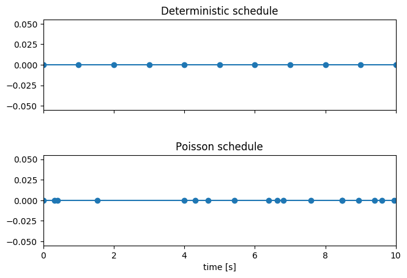
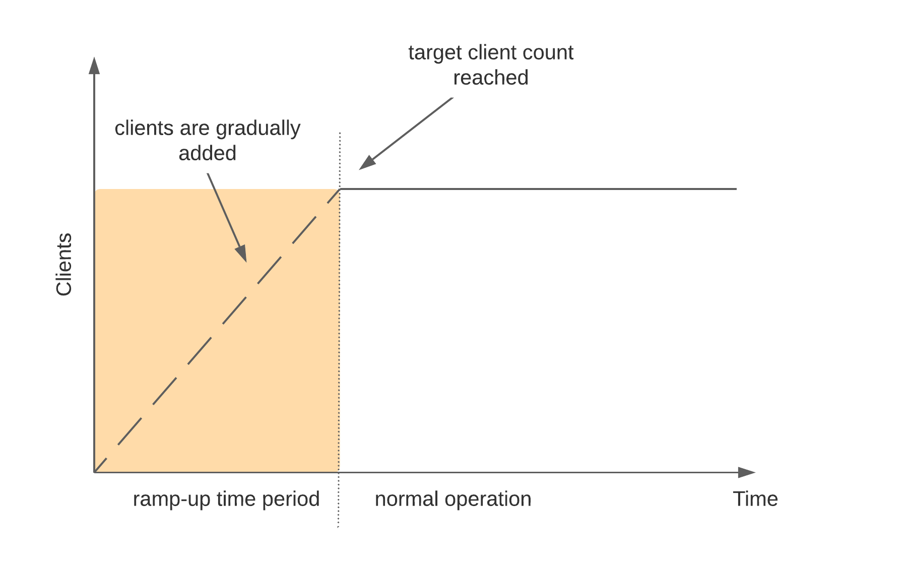
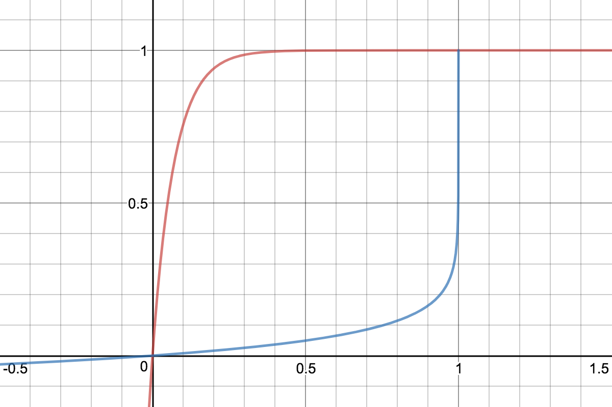
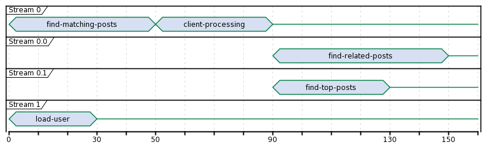

Track Reference
---------------

Definition
==========

A track is a specification of one or more benchmarking scenarios with a specific document corpus. It defines for example the involved indices or data streams, data files and the operations that are invoked. Its most important attributes are:

* One or more indices or data streams, with the former potentially each having one or more types.
* The queries to issue.
* Source URL of the benchmark data.
* A list of steps to run, which we'll call "challenge", for example indexing data with a specific number of documents per bulk request or running searches for a defined number of iterations.

Track File Format and Storage
=============================

A track is specified in a JSON file.

Ad-hoc use
..........

For ad-hoc use you can store a track definition anywhere on the file system and reference it with ``--track-path``, e.g.::

   # provide a directory - Rally searches for a track.json file in this directory
   # Track name is "app-logs"
   esrally race --track-path=~/Projects/tracks/app-logs
   # provide a file name - Rally uses this file directly
   # Track name is "syslog"
   esrally race --track-path=~/Projects/tracks/syslog.json

Rally will also search for additional files like mappings or data files in the provided directory. If you use advanced features like :ref:`custom runners <adding_tracks_custom_runners>` or :ref:`parameter sources <adding_tracks_custom_param_sources>` we recommend that you create a separate directory per track.

Custom Track Repositories
.........................

Alternatively, you can store Rally tracks also in a dedicated git repository which we call a "track repository". Rally provides a default track repository that is hosted on `Github <https://github.com/elastic/rally-tracks>`_. You can also add your own track repositories although this requires a bit of additional work. First of all, track repositories need to be managed by git. The reason is that Rally can benchmark multiple versions of Elasticsearch and we use git branches in the track repository to determine the best match for each track (based on the command line parameter ``--distribution-version``). The versioning scheme is as follows:

* The ``master`` branch needs to work with the latest ``main`` branch of Elasticsearch.
* All other branches need to match the version scheme of Elasticsearch, i.e. ``MAJOR.MINOR.PATCH-SUFFIX`` where all parts except ``MAJOR`` are optional.

.. _track-repositories-branch-logic:

When a track repository has several branches, Rally will pick the most appropriate branch, depending on the Elasticsearch version to be benchmarked, using a match logic in the following order:

#. *Exact match major.minor.patch-SUFFIX* (e.g. ``7.0.0-beta1``)
#. *Exact match major.minor.patch* (e.g. ``7.10.2``, ``6.7.0``)
#. *Exact match major.minor* (e.g. ``7.10``)
#. *Nearest prior minor branch*

    e.g. if available branches are ``master``, ``7``, ``7.2`` and ``7.11`` attempting to benchmarking ES ``7.10.2`` will pick ``7.2``, whereas benchmarking ES ``7.12.1`` will pick branch ``7.11``
#. *Nearest major branch*

    e.g. if available branches are ``master``, ``5``, ``6`` and ``7``, benchmarking ES ``7.11.0`` will pick branch ``7``

The following table explains in more detail the ES version compatibility scheme using a scenario where a track repository contains four branches ``master``, ``7.0.0-beta1``, ``7.3`` and ``6``:

.. tabularcolumns:: |l|l|

================ ===========================================================================================================
track branch     ES version compatibility
================ ===========================================================================================================
``master``       compatible only with the latest development version of Elasticsearch
``7.0.0-beta1``  compatible only with the released version ``7.0.0-beta1``
``7.3``          compatible with all ES ``7`` releases equal or greater than ``7.3`` (e.g. ``7.3.0``, ``7.10.2``)
``6``            compatible with all Elasticsearch releases with the major release number ``6`` (e.g. ``6.4.0``, ``6.8.13``)
================ ===========================================================================================================

Rally will also search for related files like mappings or custom runners or parameter sources in the track repository. However, Rally will use a separate directory to look for data files (``~/.rally/benchmarks/data/$TRACK_NAME/``). The reason is simply that we do not want to check-in multi-GB data files into git.

Creating a new track repository
~~~~~~~~~~~~~~~~~~~~~~~~~~~~~~~

All track repositories are located in ``~/.rally/benchmarks/tracks``. If you want to add a dedicated track repository, called ``private`` follow these steps::

    cd ~/.rally/benchmarks/tracks
    mkdir private
    cd private
    git init
    # add your track now
    git add .
    git commit -m "Initial commit"

If you want to share your tracks with others you need to add a remote and push it::

    git remote add origin git@git-repos.acme.com:acme/rally-tracks.git
    git push -u origin master

If you have added a remote you should also add it in ``~/.rally/rally.ini``, otherwise you can skip this step. Open the file in your editor of choice and add the following line in the section ``tracks``::

    private.url = <<URL_TO_YOUR_ORIGIN>>

If you specify ``--track-repository=private``, Rally will check whether there is a directory ``~/.rally/benchmarks/tracks/private``. If there is none, it will use the provided URL to clone the repo. However, if the directory already exists, the property gets ignored and Rally will just update the local tracking branches before the benchmark starts.

You can now verify that everything works by listing all tracks in this track repository::

    esrally list tracks --track-repository=private

This shows all tracks that are available on the ``master`` branch of this repository. Suppose you only created tracks on the branch ``2`` because you're interested in the performance of Elasticsearch 2.x, then you can specify also the distribution version::

    esrally list tracks --track-repository=private --distribution-version=7.0.0

Rally will follow the same branch fallback logic as described above.

Adding an already existing track repository
~~~~~~~~~~~~~~~~~~~~~~~~~~~~~~~~~~~~~~~~~~~

If you want to add a track repository that already exists, just open ``~/.rally/rally.ini`` in your editor of choice and add the following line in the section ``tracks``::

    your_repo_name.url = <<URL_TO_YOUR_ORIGIN>>

After you have added this line, have Rally list the tracks in this repository::

    esrally list tracks --track-repository=your_repo_name

When to use what?
.................

We recommend the following path:

* Start with a simple json file. The file name can be arbitrary.
* If you need :ref:`custom runners <adding_tracks_custom_runners>` or :ref:`parameter sources <adding_tracks_custom_param_sources>`, create one directory per track. Then you can keep everything that is related to one track in one place. Remember that the track JSON file needs to be named ``track.json``.
* If you want to version your tracks so they can work with multiple versions of Elasticsearch (e.g. you are running benchmarks before an upgrade), use a track repository.

Anatomy of a track
==================

A track JSON file can include the following sections:

* :ref:`indices <track_indices>`
* :ref:`templates <track_templates>`
* :ref:`data-streams <track_data_streams>`
* :ref:`composable-templates <track_composable_templates>`
* :ref:`component-templates <track_component_templates>`
* :ref:`corpora <track_corpora>`
* :ref:`challenge(s) <track_challenge>`
* :ref:`schedule <track_schedule>`
* :ref:`operations <track_operations>`
* :ref:`dependencies <track_dependencies>`

In the ``indices`` and ``templates`` sections you define the relevant indices and index templates. These sections are optional but recommended if you want to create indices and index templates with the help of Rally. The index templates here represent the `legacy Elasticsearch index templates <https://www.elastic.co/guide/en/elasticsearch/reference/7.9/indices-templates-v1.html>`_ which have been deprecated in Elasticsearch 7.9. Users should refer to the ``composable-templates`` and ``component-templates`` for new tracks.

In the ``data-streams`` section you define the relevant data streams. This section is optional but recommended if you want to create or delete data streams with the help of Rally. Data streams will often reference a composable template and require these to be inserted to Elasticsearch first.

In the ``composable-templates`` and ``component-templates`` sections you define the relevant composable and component templates. Although optional, these will likely be required if data streams are being used.

In the ``corpora`` section you define all document corpora (i.e. data files) that Rally should use for this track.

In the ``operations`` section you describe which operations are available for this track and how they are parametrized. This section is optional and you can also define any operations directly per challenge. You can use it if you want to share operation definitions between challenges.

In the ``schedule`` section you describe the workload for the benchmark, for example index with two clients at maximum throughput while searching with another two clients with ten operations per second. The schedule either uses the operations defined in the ``operations`` block or defines the operations to execute inline.

In the ``challenges`` section you describe more than one set of operations, in the event your track needs to test more than one set of scenarios. This section is optional, and more information can be found in the :ref:`challenges section<track_challenge>`.

Creating a track does not require all of the above sections to be used. Tracks that are used against existing data may only rely on querying ``operations`` and can omit the ``indices``, ``templates``, and ``corpora`` sections. An example of this can be found in the :ref:`task with a single track example<track_single_task>`.

Track elements
==============

The track elements that are described here are defined in `Rally's JSON schema for tracks <https://github.com/elastic/rally/blob/master/esrally/resources/track-schema.json>`_. Rally uses this track schema to validate your tracks when it is loading them.

Each track defines the following info attributes:

* ``version`` (optional): An integer describing the track specification version in use. Rally uses it to detect incompatible future track specification versions and raise an error. See the table below for a reference of valid versions.
* ``description`` (optional): A human-readable description of the track. Although it is optional, we recommend providing it.

=========================== =================
Track Specification Version Rally version
=========================== =================
                          1  >=0.7.3, <0.10.0
                          2           >=0.9.0
=========================== =================

The ``version`` property has been introduced with Rally 0.7.3. Rally versions before 0.7.3 do not recognize this property and thus cannot detect incompatible track specification versions.

Example::

    {
        "version": 2,
        "description": "POIs from Geonames"
    }

meta
....

For each track, an optional structure, called ``meta`` can be defined. You are free which properties this element should contain.

This element can also be defined on the following elements:

* ``challenge``
* ``operation``
* ``task``

If the ``meta`` structure contains the same key on different elements, more specific ones will override the same key of more generic elements. The order from generic to most specific is:

1. track
2. challenge
3. operation
4. task

E.g. a key defined on a task, will override the same key defined on a challenge. All properties defined within the merged ``meta`` structure, will get copied into each metrics record.

.. _track_indices:

indices
.......

The ``indices`` section contains a list of all indices that are used by this track. Cannot be used if the ``data-streams`` section is specified.

Each index in this list consists of the following properties:

* ``name`` (mandatory): The name of the index.
* ``body`` (optional): File name of the corresponding index definition that will be used as body in the create index API call.
* ``types`` (optional): A list of type names in this index. Types have been removed in Elasticsearch 7.0.0 so you must not specify this property if you want to benchmark Elasticsearch 7.0.0 or later.

Example::

    "indices": [
        {
          "name": "geonames",
          "body": "geonames-index.json",
          "types": ["docs"]
        }
    ]

.. _track_templates:

templates
.........

The ``templates`` section contains a list of all index templates that Rally should create.

* ``name`` (mandatory): Index template name.
* ``index-pattern`` (mandatory): Index pattern that matches the index template. This must match the definition in the index template file.
* ``delete-matching-indices`` (optional, defaults to ``true``): Delete all indices that match the provided index pattern before start of the benchmark.
* ``template`` (mandatory): Index template file name.

Example::

    "templates": [
        {
            "name": "my-default-index-template",
            "index-pattern": "my-index-*",
            "delete-matching-indices": true,
            "template": "default-template.json"
        }
    ]

.. _track_data_streams:

data-streams
............

The ``data-streams`` section contains a list of all data streams that are used by this track. Cannot be used if the ``indices`` section is specified.

Each data stream in this list consists of the following properties:

* ``name`` (mandatory): The name of the data-stream.

Example::

    "data-streams": [
        {
          "name": "my-logging-data-stream"
        }
    ]

.. _track_composable_templates:

composable-templates
....................

The ``composable-templates`` section contains a list of all composable templates that Rally should create. These composable templates will often reference component templates which should also be declared first using the ``component-templates`` section.

Each composable template in this list consists of the following properties:

* ``name`` (mandatory): Composable template name.
* ``index-pattern`` (mandatory): Index pattern that matches the composable template. This must match the definition in the template file.
* ``delete-matching-indices`` (optional, defaults to ``true``): Delete all indices that match the provided index pattern if the template is deleted.
* ``template`` (mandatory): Composable template file name.
* ``template-path`` (optional): JSON field inside the file content that contains the template.

Example::

    "composable-templates": [
        {
            "name": "my-default-composable-template",
            "index-pattern": "my-index-*",
            "delete-matching-indices": true,
            "template": "composable-template.json"
        }
    ]

.. _track_component_templates:

component-templates
....................

The ``component-templates`` section contains a list of all component templates that Rally should create. These component templates will often be referenced by composable templates which can be declared using the ``composable-templates`` section.

Each component template in this list consists of the following properties:

* ``name`` (mandatory): Component template name.
* ``template`` (mandatory): Component template file name.
* ``template-path`` (optional): JSON field inside the file content that contains the template.

Example::

    "component-templates": [
        {
            "name": "my-default-component-template",
            "template": "one-shard-template.json"
        }
    ]

.. _track_corpora:

corpora
.......

The ``corpora`` section contains all document corpora that are used by this track. Note that you can reuse document corpora across tracks; just copy & paste the respective corpora definitions. It consists of the following properties:

* ``name`` (mandatory): Name of this document corpus. As this name is also used by Rally in directory names, it is recommended to only use lower-case names without whitespaces for maximum compatibility across file systems.
* ``documents`` (mandatory): A list of documents files.
* ``meta`` (optional): A mapping of arbitrary key-value pairs with additional meta-data for a corpus.

Each entry in the ``documents`` list consists of the following properties:

* ``base-url`` (optional): A http(s), S3 or Google Storage URL that points to the root path where Rally can obtain the corresponding source file.

  * S3 support is optional and can be installed with ``python -m pip install esrally[s3]``.
  * http(s) and Google Storage are supported by default.

  Rally can also download data from private S3 or Google Storage buckets if access is properly configured:

  * S3 according to `docs <https://boto3.amazonaws.com/v1/documentation/api/latest/guide/quickstart.html#configuration>`_.
  * Google Storage: Either using `client library authentication <https://cloud.google.com/storage/docs/reference/libraries#setting_up_authentication>`_ or by presenting an `oauth2 token <https://cloud.google.com/storage/docs/authentication>`_ via the ``GOOGLE_AUTH_TOKEN`` environment variable, typically done using: ``export GOOGLE_AUTH_TOKEN=$(gcloud auth print-access-token)``.
* ``source-format`` (optional, default: ``bulk``): Defines in which format Rally should interpret the data file specified by ``source-file``. Currently, only ``bulk`` is supported.
* ``source-file`` (mandatory): File name of the corresponding documents. For local use, this file can be a ``.json`` file. If you provide a ``base-url`` we recommend that you provide a compressed file here. The following extensions are supported: ``.zip``, ``.bz2``, ``.gz``, ``.tar``, ``.tar.gz``, ``.tgz`` or ``.tar.bz2``. It must contain exactly one JSON file with the same name. The preferred file extension for our official tracks is ``.bz2``.
* ``includes-action-and-meta-data`` (optional, defaults to ``false``): Defines whether the documents file contains already an `action and meta-data <https://www.elastic.co/guide/en/elasticsearch/reference/current/docs-bulk.html#docs-bulk-api-desc>`_ line (``true``) or only documents (``false``).

    .. note::

        When this is ``true``, the ``document-count`` property should only reflect the number of documents and not additionally include the number of action and metadata lines.

* ``document-count`` (mandatory): Number of documents in the source file. This number is used by Rally to determine which client indexes which part of the document corpus (each of the N clients gets one N-th of the document corpus). If you are using parent-child, specify the number of parent documents.
* ``compressed-bytes`` (optional but recommended): The size in bytes of the compressed source file. This number is used to show users how much data will be downloaded by Rally and also to check whether the download is complete.
* ``uncompressed-bytes`` (optional but recommended): The size in bytes of the source file after decompression. This number is used by Rally to show users how much disk space the decompressed file will need and to check that the whole file could be decompressed successfully.
* ``target-index``: Defines the name of the index which should be targeted for bulk operations. Rally will automatically derive this value if you have defined exactly one index in the ``indices`` section. Ignored if ``includes-action-and-meta-data`` is ``true``.
* ``target-type`` (optional): Defines the name of the document type which should be targeted for bulk operations. Rally will automatically derive this value if you have defined exactly one index in the ``indices`` section and this index has exactly one type. Ignored if ``includes-action-and-meta-data`` is ``true`` or if a ``target-data-stream`` is specified. Types have been removed in Elasticsearch 7.0.0 so you must not specify this property if you want to benchmark Elasticsearch 7.0.0 or later.
* ``target-data-stream``: Defines the name of the data stream which should be targeted for bulk operations. Rally will automatically derive this value if you have defined exactly one index in the ``data-streams`` section. Ignored if ``includes-action-and-meta-data`` is ``true``.
* ``target-index``: Defines the name of the index which should be targeted for bulk operations. Rally will automatically derive this value if you have defined exactly one index in the ``indices`` section. Ignored if ``includes-action-and-meta-data`` is ``true``.
* ``target-type`` (optional): Defines the name of the document type which should be targeted for bulk operations. Rally will automatically derive this value if you have defined exactly one index in the ``indices`` section and this index has exactly one type. Ignored if ``includes-action-and-meta-data`` is ``true``. Types have been removed in Elasticsearch 7.0.0 so you must not specify this property if you want to benchmark Elasticsearch 7.0.0 or later.
* ``meta`` (optional): A mapping of arbitrary key-value pairs with additional meta-data for a source file.

To avoid repetition, you can specify default values on document corpus level for the following properties:

* ``base-url``
* ``source-format``
* ``includes-action-and-meta-data``
* ``target-index``
* ``target-type``
* ``target-data-stream``

Examples

Here we define a single document corpus with one set of documents::

      "corpora": [
        {
          "name": "geonames",
          "documents": [
            {
              "base-url": "http://benchmarks.elasticsearch.org.s3.amazonaws.com/corpora/geonames",
              "source-file": "documents.json.bz2",
              "document-count": 11396505,
              "compressed-bytes": 264698741,
              "uncompressed-bytes": 3547614383,
              "target-index": "geonames",
              "target-type": "docs"
            }
          ]
        }
      ]

Here we define a single document corpus with one set of documents using data streams instead of indices::

      "corpora": [
        {
          "name": "http_logs",
          "documents": [
            {
              "base-url": "http://benchmarks.elasticsearch.org.s3.amazonaws.com/corpora/http_logs",
              "source-file": "documents-181998.json.bz2",
              "document-count": 2708746,
              "target-data-stream": "my-logging-data-stream"
            }
          ]
        }
      ]

We can also define default values on document corpus level but override some of them (``base-url`` for the last entry)::

      "corpora": [
        {
          "name": "http_logs",
          "base-url": "http://benchmarks.elasticsearch.org.s3.amazonaws.com/corpora/http_logs",
          "target-type": "docs",
          "documents": [
            {
              "source-file": "documents-181998.json.bz2",
              "document-count": 2708746,
              "target-index": "logs-181998"
            },
            {
              "source-file": "documents-191998.json.bz2",
              "document-count": 9697882,
              "target-index": "logs-191998"
            },
            {
              "base-url": "http://example.org/corpora/http_logs",
              "source-file": "documents-201998.json.bz2",
              "document-count": 13053463,
              "target-index": "logs-201998"
            }
          ]
        }
      ]

.. _track_challenge:

challenge
.........

If your track defines only one benchmarking scenario specify the ``schedule`` on top-level. Use the ``challenge`` element if you want to specify additional properties like a name or a description. You can think of a challenge as a benchmarking scenario. If you have multiple challenges, you can define an array of ``challenges``.

This section contains one or more challenges which describe the benchmark scenarios for this data set. A challenge can reference all operations that are defined in the ``operations`` section.

Each challenge consists of the following properties:

* ``name`` (mandatory): A descriptive name of the challenge. Should not contain spaces in order to simplify handling on the command line for users.
* ``description`` (optional): A human readable description of the challenge.
* ``user-info`` (optional): A message that is printed at the beginning of a race. It is intended to be used to notify e.g. about deprecations.
* ``default`` (optional): If true, Rally selects this challenge by default if the user did not specify a challenge on the command line. If your track only defines one challenge, it is implicitly selected as default, otherwise you need to define ``"default": true`` on exactly one challenge.
* ``schedule`` (mandatory): Defines the workload. It is described in more detail below.

.. note::

    You should strive to minimize the number of challenges. If you just want to run a subset of the tasks in a challenge, use :ref:`task filtering <clr_include_tasks>`.

.. _track_schedule:

schedule
........

The ``schedule`` element contains a list of tasks that are executed by Rally, i.e. it describes the workload. Each task consists of the following properties:

* ``name`` (optional): This property defines an explicit name for the given task. By default the operation's name is implicitly used as the task name but if the same operation is run multiple times, a unique task name must be specified using this property.
* ``tags`` (optional): This property defines one or more tags for the given task. This can be used for :ref:`task filtering <clr_include_tasks>`, e.g. with ``--exclude-tasks="tag:setup"`` all tasks except the ones that contain the tag ``setup`` are executed.
* ``operation`` (mandatory): This property refers either to the name of an operation that has been defined in the ``operations`` section or directly defines an operation inline.
* ``clients`` (optional, defaults to 1): The number of clients that should execute a task concurrently.
* ``warmup-iterations`` (optional, defaults to 0): Number of iterations that each client should execute to warmup the benchmark candidate. Warmup iterations will not show up in the measurement results.
* ``iterations`` (optional, defaults to 1): Number of measurement iterations that each client executes. The command line report will automatically adjust the percentile numbers based on this number (i.e. if you just run 5 iterations you will not get a 99.9th percentile because we need at least 1000 iterations to determine this value precisely).
* ``ramp-up-time-period`` (optional, defaults to 0): Rally will start clients gradually. It reaches the number specified by ``clients`` at the end of the specified time period in seconds. This property requires ``warmup-time-period`` to be set as well, which must be greater than or equal to the ramp-up time. See the section on :ref:`ramp-up <track_ramp_up>` for more details.
* ``warmup-time-period`` (optional, defaults to 0): A time period in seconds that Rally considers for warmup of the benchmark candidate. All response data captured during warmup will not show up in the measurement results.
* ``time-period`` (optional): A time period in seconds that Rally considers for measurement. Note that for bulk indexing you should usually not define this time period. Rally will just bulk index all documents and consider every sample after the warmup time period as measurement sample.
* ``schedule`` (optional, defaults to ``deterministic``): Defines the schedule for this task, i.e. it defines at which point in time during the benchmark an operation should be executed. For example, if you specify a ``deterministic`` schedule and a target-interval of 5 (seconds), Rally will attempt to execute the corresponding operation at second 0, 5, 10, 15 ... . Out of the box, Rally supports ``deterministic`` and ``poisson`` but you can define your own :doc:`custom schedules </adding_tracks>`.
* ``target-throughput`` (optional): Defines the benchmark mode. If it is not defined, Rally assumes this is a throughput benchmark and will run the task as fast as it can. This is mostly needed for batch-style operations where it is more important to achieve the best throughput instead of an acceptable latency. If it is defined, it specifies the number of requests per second over all clients. E.g. if you specify ``target-throughput: 1000`` with 8 clients, it means that each client will issue 125 (= 1000 / 8) requests per second. In total, all clients will issue 1000 requests each second. If Rally reports less than the specified throughput then Elasticsearch simply cannot reach it.
* ``target-interval`` (optional): This is just ``1 / target-throughput`` (in seconds) and may be more convenient for cases where the throughput is less than one operation per second. Define either ``target-throughput`` or ``target-interval`` but not both (otherwise Rally will raise an error).
* ``ignore-response-error-level`` (optional): Controls whether to ignore errors encountered during task execution when the benchmark is run with :ref:`on-error=abort <command_line_reference_on_error>`. The only allowable value is ``non-fatal`` which, combined with the cli option ``--on-error=abort``, will ignore non-fatal errors during the execution of the task.

    .. note::

        Consult the docs on the :ref:`cli option on-error <command_line_reference_on_error>` for a definition of fatal errors.

Defining operations
~~~~~~~~~~~~~~~~~~~

In the following snippet we define two operations ``force-merge`` and a ``match-all`` query separately in an operations block::

    {
      "operations": [
        {
          "name": "force-merge",
          "operation-type": "force-merge"
        },
        {
          "name": "match-all-query",
          "operation-type": "search",
          "body": {
            "query": {
              "match_all": {}
            }
          }
        }
      ],
      "schedule": [
        {
          "operation": "force-merge",
          "clients": 1
        },
        {
          "operation": "match-all-query",
          "clients": 4,
          "warmup-iterations": 1000,
          "iterations": 1000,
          "target-throughput": 100
        }
      ]
    }

If we do not want to reuse these operations, we can also define them inline. Note that the ``operations`` section is gone::

    {
      "schedule": [
        {
          "operation": {
            "name": "force-merge",
            "operation-type": "force-merge"
          },
          "clients": 1
        },
        {
          "operation": {
            "name": "match-all-query",
            "operation-type": "search",
            "body": {
              "query": {
                "match_all": {}
              }
            }
          },
          "clients": 4,
          "warmup-iterations": 1000,
          "iterations": 1000,
          "target-throughput": 100
        }
      ]
    }

Contrary to the ``query``, the ``force-merge`` operation does not take any parameters, so Rally allows us to just specify the ``operation-type`` for this operation. Its name will be the same as the operation's type::

    {
      "schedule": [
        {
          "operation": "force-merge",
          "clients": 1
        },
        {
          "operation": {
            "name": "match-all-query",
            "operation-type": "search",
            "body": {
              "query": {
                "match_all": {}
              }
            }
          },
          "clients": 4,
          "warmup-iterations": 1000,
          "iterations": 1000,
          "target-throughput": 100
        }
      ]
    }

.. _track_choose_schedule:

Choosing a schedule
~~~~~~~~~~~~~~~~~~~

Rally allows you to choose between the following schedules to simulate traffic:

* `deterministically distributed <https://en.wikipedia.org/wiki/Degenerate_distribution>`_
* `Poisson distributed <https://en.wikipedia.org/wiki/Poisson_distribution>`_

The diagram below shows how different schedules in Rally behave during the first ten seconds of a benchmark. Each schedule is configured for a (mean) target throughput of one operation per second.

If you want as much reproducibility as possible you can choose the `deterministic` schedule. A Poisson distribution models random independent arrivals of clients which on average match the expected arrival rate which makes it suitable for modelling the behaviour of multiple clients that decide independently when to issue a request. For this reason, Poisson processes play an important role in `queueing theory <https://en.wikipedia.org/wiki/Queueing_theory>`_.

If you have more complex needs on how to model traffic, you can also implement a :doc:`custom schedule </adding_tracks>`.

.. _track_ramp_up:

Ramp-up load
~~~~~~~~~~~~

For benchmarks involving many clients it can be useful to increase load gradually. This avoids load spikes at the beginning of a benchmark when Elasticsearch is not yet warmed up. Rally will gradually add more clients over time but each client will already attempt to reach its specified target throughput. The diagram below shows how clients are added over time:

Time-based vs. iteration-based
~~~~~~~~~~~~~~~~~~~~~~~~~~~~~~

You should usually use time periods for batch style operations and iterations for the rest. However, you can also choose to run a query for a certain time period.

All tasks in the ``schedule`` list are executed sequentially in the order in which they have been defined. However, it is also possible to execute multiple tasks concurrently, by wrapping them in a ``parallel`` element. The ``parallel`` element defines of the following properties:

* ``clients`` (optional): The number of clients that should execute the provided tasks. If you specify this property, Rally will only use as many clients as you have defined on the ``parallel`` element (see examples)!
* ``ramp-up-time-period`` (optional, defaults to 0): The time-period in seconds across all nested tasks to spend in ramp-up. If this property is defined here, it cannot be overridden in nested tasks. This property requires ``warmup-time-period`` to be set as well, which must be greater than or equal to the ramp-up time. See the section on :ref:`ramp-up <track_ramp_up>` for more details.
* ``warmup-time-period`` (optional, defaults to 0): Allows to define a default value for all tasks of the ``parallel`` element.
* ``time-period`` (optional, no default value if not specified): Allows to define a default value for all tasks of the ``parallel`` element.
* ``warmup-iterations`` (optional, defaults to 0): Allows to define a default value for all tasks of the ``parallel`` element.
* ``iterations`` (optional, defaults to 1): Allows to define a default value for all tasks of the ``parallel`` element.
* ``completed-by`` (optional): Allows to define the name of one task in the ``tasks`` list, or the value ``any``. If a specific task name has been provided then as soon as the named task has completed, the whole ``parallel`` task structure is considered completed. If the value ``any`` is provided, then any task that is first to complete will render the ``parallel`` structure complete. If this property is not explicitly defined, the ``parallel`` task structure is considered completed as soon as all its subtasks have completed (NOTE: this is _not_ true if ``any`` is specified, see below warning and example).
* ``tasks`` (mandatory): Defines a list of tasks that should be executed concurrently. Each task in the list can define the following properties that have been defined above: ``clients``, ``warmup-time-period``, ``time-period``, ``warmup-iterations`` and ``iterations``.

.. note::

    ``parallel`` elements cannot be nested.

.. warning::

    Specify the number of clients on each task separately. If you specify this number on the ``parallel`` element instead, Rally will only use that many clients in total and you will only want to use this behavior in very rare cases (see examples)!

.. warning::

    If the value ``any`` is provided for the ``completed-by`` parameter, the first completion of a client task in the ``parallel`` block will cause all remaining clients and tasks within the ``parallel`` block to immediately exit without waiting for completion.

    For example, given the below track:

        1. Both ``bulk-task-1`` and ``bulk-task-2`` execute in parallel
        2. ``bulk-task-1`` Client 1/8 is first to complete its assigned partition of work
        3. ``bulk-task-1`` will now cause the ``parallel`` task to complete and **not** wait for either the remaining seven ``bulk-task-1``'s clients to complete, or for any of ``bulk-task-2``'s clients to complete

    ::

        {
          "name": "parallel-any",
          "description": "Track completed-by property",
          "schedule": [
            {
              "parallel": {
                "completed-by": "any",
                "tasks": [
                  {
                    "name": "bulk-task-1",
                    "operation": {
                      "operation-type": "bulk",
                      "bulk-size": 1000
                    },
                    "clients": 8
                  },
                  {
                    "name": "bulk-task-2",
                    "operation": {
                      "operation-type": "bulk",
                      "bulk-size": 500
                    },
                    "clients": 8
                  }
                ]
              }
            }
          ]
        }

.. _track_operations:

operations
..........

The ``operations`` section contains a list of all operations that are available when specifying a schedule. Operations define the static properties of a request against Elasticsearch whereas the ``schedule`` element defines the dynamic properties (such as the target throughput).

Each operation consists of the following properties:

* ``name`` (mandatory): The name of this operation. You can choose this name freely. It is only needed to reference the operation when defining schedules.
* ``operation-type`` (mandatory): Type of this operation. See below for the operation types that are supported out of the box in Rally. You can also add arbitrary operations by defining :doc:`custom runners </adding_tracks>`.
* ``include-in-reporting`` (optional, defaults to ``true`` for normal operations and to ``false`` for administrative operations): Whether or not this operation should be included in the command line report. For example you might want Rally to create an index for you but you are not interested in detailed metrics about it. Note that Rally will still record all metrics in the metrics store.
* ``assertions`` (optional, defaults to ``None``): A list of assertions that should be checked. See below for more details.
* ``request-timeout`` (optional, defaults to ``None``): The client-side timeout for this operation. Represented as a floating-point number in seconds, e.g. ``1.5``.
* ``headers`` (optional, defaults to ``None``): A dictionary of key-value pairs to pass as headers in the operation.
* ``opaque-id`` (optional, defaults to ``None`` [unused]): A special ID set as the value of ``x-opaque-id`` in the client headers of the operation. Overrides existing ``x-opaque-id`` entries in ``headers`` (case-insensitive).

**Assertions**

Use assertions for sanity checks, e.g. to ensure a query returns results. Assertions need to be defined with the following properties. All of them are mandatory:

* ``property``: A dot-delimited path to the meta-data field to be checked. Only meta-data fields that are returned by an operation are supported. See the respective "meta-data" section of an operation for the supported meta-data.
* ``condition``: The following conditions are supported: ``<``, ``<=``, ``==``, ``>=``, ``>``.
* ``value``: The expected value.

Assertions are disabled by default and can be enabled with the command line flag ``--enable-assertions``. A failing assertion aborts the benchmark.

Example::

    {
      "name": "term",
      "operation-type": "search",
      "detailed-results": true,
      "assertions": [
        {
          "property": "hits",
          "condition": ">",
          "value": 0
        }
      ],
      "body": {
        "query": {
          "term": {
            "country_code.raw": "AT"
          }
        }
      }
    }

.. note::

    This requires to set ``detailed-results`` to ``true`` so the search operation gathers additional meta-data, such as the number of hits.

If assertions are enabled with ``--enable-assertions`` and this assertion fails, it exits with the following error message::

    [ERROR] Cannot race. Error in load generator [0]
        Cannot run task [term]: Expected [hits] to be > [0] but was [0].

**Retries**

Some of the operations below are also retryable (marked accordingly below). Retryable operations expose the following properties:

* ``retries`` (optional, defaults to 0): The number of times the operation is retried.
* ``retry-until-success`` (optional, defaults to ``false``): Retries until the operation returns a success. This will also forcibly set ``retry-on-error`` to ``true``.
* ``retry-wait-period`` (optional, defaults to 0.5): The time in seconds to wait between retry attempts.
* ``retry-on-timeout`` (optional, defaults to ``true``): Whether to retry on connection timeout.
* ``retry-on-error`` (optional, defaults to ``false``): Whether to retry on errors (e.g. when an index could not be deleted).

Depending on the operation type a couple of further parameters can be specified.

bulk
~~~~

With the operation type ``bulk`` you can execute `bulk requests <http://www.elastic.co/guide/en/elasticsearch/reference/current/docs-bulk.html>`_.

Properties
""""""""""

* ``bulk-size`` (mandatory): Defines the bulk size in number of documents.
* ``ingest-percentage`` (optional, defaults to 100): A number between (0, 100] that defines how much of the document corpus will be bulk-indexed.
* ``corpora`` (optional): A list of document corpus names that should be targeted by this bulk-index operation. Only needed if the ``corpora`` section contains more than one document corpus and you don't want to index all of them with this operation.
* ``indices`` (optional): A list of index names that defines which indices should be used by this bulk-index operation. Rally will then only select the documents files that have a matching ``target-index`` specified.
* ``batch-size`` (optional): Defines how many documents Rally will read at once. This is an expert setting and only meant to avoid accidental bottlenecks for very small bulk sizes (e.g. if you want to benchmark with a bulk-size of 1, you should set ``batch-size`` higher).
* ``pipeline`` (optional): Defines the name of an (existing) ingest pipeline that should be used.
* ``conflicts`` (optional): Type of index conflicts to simulate. If not specified, no conflicts will be simulated (also read below on how to use external index ids with no conflicts). Valid values are: 'sequential' (A document id is replaced with a document id with a sequentially increasing id), 'random' (A document id is replaced with a document id with a random other id).
* ``conflict-probability`` (optional, defaults to 25 percent): A number between [0, 100] that defines how many of the documents will get replaced. Combining ``conflicts=sequential`` and ``conflict-probability=0`` makes Rally generate index ids by itself, instead of relying on Elasticsearch's `automatic id generation <https://www.elastic.co/guide/en/elasticsearch/reference/current/docs-index_.html#_automatic_id_generation>`_.
* ``on-conflict`` (optional, defaults to ``index``): Determines whether Rally should use the action ``index`` or ``update`` on id conflicts.
* ``recency`` (optional, defaults to 0): A number between [0,1] indicating whether to bias conflicting ids towards more recent ids (``recency`` towards 1) or whether to consider all ids for id conflicts (``recency`` towards 0). See the diagram below for details.
* ``detailed-results`` (optional, defaults to ``false``): Records more detailed meta-data for bulk requests. As it analyzes the corresponding bulk response in more detail, this might incur additional overhead which can skew measurement results. See the section below for the meta-data that are returned. This property must be set to ``true`` for individual bulk request failures to be logged by Rally.
* ``timeout`` (optional, defaults to ``1m``): Defines the `time period that Elasticsearch will wait per action <https://www.elastic.co/guide/en/elasticsearch/reference/current/docs-bulk.html#docs-bulk-api-query-params>`_ until it has finished processing the following operations: automatic index creation, dynamic mapping updates, waiting for active shards.

The image below shows how Rally behaves with a ``recency`` set to 0.5. Internally, Rally uses the blue function for its calculations but to understand the behavior we will focus on red function (which is just the inverse). Suppose we have already generated ids from 1 to 100 and we are about to simulate an id conflict. Rally will randomly choose a value on the y-axis, e.g. 0.8 which is mapped to 0.1 on the x-axis. This means that in 80% of all cases, Rally will choose an id within the most recent 10%, i.e. between 90 and 100. With 20% probability the id will be between 1 and 89. The closer ``recency`` gets to zero, the "flatter" the red curve gets and the more likely Rally will choose less recent ids.

You can also `explore the recency calculation interactively <https://www.desmos.com/calculator/zlzieypanv>`_.

Example::

    {
      "name": "index-append",
      "operation-type": "bulk",
      "bulk-size": 5000
    }

Throughput will be reported as number of indexed documents per second.

Meta-data
"""""""""

The following meta-data are always returned:

* ``index``: name of the affected index. May be ``null`` if it could not be derived.
* ``weight``: operation-agnostic representation of the bulk size denoted in ``unit``.
* ``unit``: The unit in which to interpret ``weight``.
* ``success``: A boolean indicating whether the bulk request has succeeded.
* ``success-count``: Number of successfully processed bulk items for this request. This value will only be determined in case of errors or the bulk-size has been specified in docs.
* ``error-count``: Number of failed bulk items for this request.
* ``took``: Value of the the ``took`` property in the bulk response.

If ``detailed-results`` is ``true`` the following meta-data are returned in addition:

* ``ops``: A nested document with the operation name as key (e.g. ``index``, ``update``, ``delete``) and various counts as values. ``item-count`` contains the total number of items for this key. Additionally, we return a separate counter for each result (indicating e.g. the number of created items, the number of deleted items etc.).
* ``shards_histogram``: An array of hashes where each hash has two keys: ``item-count`` contains the number of items to which a shard distribution applies and ``shards`` contains another hash with the actual distribution of ``total``, ``successful`` and ``failed`` shards (see examples below).
* ``bulk-request-size-bytes``: Total size of the bulk request body in bytes.
* ``total-document-size-bytes``: Total size of all documents within the bulk request body in bytes.

**Examples**

If ``detailed-results`` is ``false`` a typical return value is::

    {
        "index": "my_index",
        "weight": 5000,
        "unit": "docs",
        "success": True,
        "success-count": 5000,
        "error-count": 0,
        "took": 20
    }

Whereas the response will look as follow if there are bulk errors::

    {
        "index": "my_index",
        "weight": 5000,
        "unit": "docs",
        "success": False,
        "success-count": 4000,
        "error-count": 1000,
        "took": 20
    }

If ``detailed-results`` is ``true`` a typical return value is::

    {
        "index": "my_index",
        "weight": 5000,
        "unit": "docs",
        "bulk-request-size-bytes": 2250000,
        "total-document-size-bytes": 2000000,
        "success": True,
        "success-count": 5000,
        "error-count": 0,
        "took": 20,
        "ops": {
            "index": {
                "item-count": 5000,
                "created": 5000
            }
        },
        "shards_histogram": [
            {
                "item-count": 5000,
                "shards": {
                    "total": 2,
                    "successful": 2,
                    "failed": 0
                }
            }
        ]
    }

An example error response may look like this::

    {
        "index": "my_index",
        "weight": 5000,
        "unit": "docs",
        "bulk-request-size-bytes": 2250000,
        "total-document-size-bytes": 2000000,
        "success": False,
        "success-count": 4000,
        "error-count": 1000,
        "took": 20,
        "ops": {
            "index": {
                "item-count": 5000,
                "created": 4000,
                "noop": 1000
            }
        },
        "shards_histogram": [
            {
                "item-count": 4000,
                "shards": {
                    "total": 2,
                    "successful": 2,
                    "failed": 0
                }
            },
            {
                "item-count": 500,
                "shards": {
                    "total": 2,
                    "successful": 1,
                    "failed": 1
                }
            },
            {
                "item-count": 500,
                "shards": {
                    "total": 2,
                    "successful": 0,
                    "failed": 2
                }
            }
        ]
    }

force-merge
~~~~~~~~~~~

With the operation type ``force-merge`` you can call the `force merge API <http://www.elastic.co/guide/en/elasticsearch/reference/current/indices-forcemerge.html>`_.

Properties
""""""""""

* ``index`` (optional, defaults to the indices defined in the ``indices`` section or the data streams defined in the ``data-streams`` section. If neither are defined defaults to ``_all``.): The name of the index or data stream that should be force-merged.
* ``mode`` (optional, default to ``blocking``): In the default ``blocking`` mode the Elasticsearch client blocks until the operation returns or times out as dictated by the :ref:`client-options <clr_client_options>`. In mode `polling` the client timeout is ignored. Instead, the api call is given 1s to complete. If the operation has not finished, the operator will poll every ``poll-period`` until all force merges are complete.
* ``poll-period`` (defaults to 10s): Only applicable if ``mode`` is set to ``polling``. Determines the internal at which a check is performed that all force merge operations are complete.
* ``max-num-segments`` (optional)  The number of segments the index should be merged into. Defaults to simply checking if a merge needs to execute, and if so, executes it.

This is an administrative operation. Metrics are not reported by default. If reporting is forced by setting ``include-in-reporting`` to ``true``, then throughput is reported as the number of completed force-merge operations per second.

Meta-data
"""""""""

This operation returns no meta-data.

index-stats
~~~~~~~~~~~

With the operation type ``index-stats`` you can call the `index stats API <http://www.elastic.co/guide/en/elasticsearch/reference/current/indices-stats.html>`_.

Properties
""""""""""

* ``index`` (optional, defaults to `_all`): An `index pattern <https://www.elastic.co/guide/en/elasticsearch/reference/current/multi-index.html>`_ that defines which indices should be targeted by this operation.
* ``condition`` (optional, defaults to no condition): A structured object with the properties ``path`` and ``expected-value``. If the actual value returned by index stats API is equal to the expected value at the provided path, this operation will return successfully. See below for an example how this can be used.

In the following example the ``index-stats`` operation will wait until all segments have been merged::

    {
        "operation-type": "index-stats",
        "index": "_all",
        "condition": {
            "path": "_all.total.merges.current",
            "expected-value": 0
        },
        "retry-until-success": true
    }

Throughput will be reported as number of completed `index-stats` operations per second.

This operation is :ref:`retryable <track_operations>`.

Meta-data
"""""""""

* ``weight``: Always 1.
* ``unit``: Always "ops".
* ``success``: A boolean indicating whether the operation has succeeded.

node-stats
~~~~~~~~~~

With the operation type ``nodes-stats`` you can execute `nodes stats API <http://www.elastic.co/guide/en/elasticsearch/reference/current/cluster-nodes-stats.html>`_. It does not support any parameters.

Throughput will be reported as number of completed `node-stats` operations per second.

Meta-data
"""""""""

This operation returns no meta-data.

search
~~~~~~

With the operation type ``search`` you can execute `request body searches <http://www.elastic.co/guide/en/elasticsearch/reference/current/search-search.html>`_.

Properties
""""""""""

* ``index`` (optional): An `index pattern <https://www.elastic.co/guide/en/elasticsearch/reference/current/multi-index.html>`_ that defines which indices or data streams should be targeted by this query. Only needed if the ``indices`` or ``data-streams`` section contains more than one index or data stream respectively. Otherwise, Rally will automatically derive the index or data stream to use. If you have defined multiple indices or data streams and want to query all of them, just specify ``"index": "_all"``.
* ``type`` (optional): Defines the type within the specified index for this query. By default, no ``type`` will be used and the query will be performed across all types in the provided index. Also, types have been removed in Elasticsearch 7.0.0 so you must not specify this property if you want to benchmark Elasticsearch 7.0.0 or later.
* ``cache`` (optional): Whether to use the query request cache. By default, Rally will define no value thus the default depends on the benchmark candidate settings and Elasticsearch version.
* ``request-params`` (optional): A structure containing arbitrary request parameters. The supported parameters names are documented in the `Search URI Request docs <https://www.elastic.co/guide/en/elasticsearch/reference/current/search-uri-request.html#_parameters_3>`_.

    .. note::
        1. Parameters that are implicitly set by Rally (e.g. ``body`` or ``request_cache``) are not supported (i.e. you should not try to set them and if so expect unspecified behavior).
        2. Rally will not attempt to serialize the parameters and pass them as is. Always use "true" / "false" strings for boolean parameters (see example below).

* ``body`` (mandatory): The query body.
* ``response-compression-enabled`` (optional, defaults to ``true``): Allows to disable HTTP compression of responses. As these responses are sometimes large and decompression may be a bottleneck on the client, it is possible to turn off response compression.
* ``detailed-results`` (optional, defaults to ``false``): Records more detailed meta-data about queries. As it analyzes the corresponding response in more detail, this might incur additional overhead which can skew measurement results. This flag is ineffective for scroll queries.
* ``pages`` (optional, deprecated): Number of pages to retrieve. If this parameter is present, a scroll query will be executed. If you want to retrieve all result pages, use the value "all". This parameter is deprecated and will be replaced with the ``scroll-search`` operation in a future release.
* ``results-per-page`` (optional):  Number of documents to retrieve per page. This maps to the Search API's ``size`` parameter, and can be used for scroll and non-scroll searches. Defaults to ``10``

Example::

    {
      "name": "default",
      "operation-type": "search",
      "body": {
        "query": {
          "match_all": {}
        }
      },
      "request-params": {
        "_source_include": "some_field",
        "analyze_wildcard": "false"
      }
    }

For scroll queries, throughput will be reported as number of retrieved pages per second (``pages/s``). The rationale is that each HTTP request corresponds to one operation and we need to issue one HTTP request per result page.

For other queries, throughput will be reported as number of search requests per second (``ops/s``).

 Note that if you use a dedicated Elasticsearch metrics store, you can also use other request-level meta-data such as the number of hits for your own analyses.

Meta-data
"""""""""

The following meta data are always returned:

* ``weight``: "weight" of an operation. Always 1 for regular queries and the number of retrieved pages for scroll queries.
* ``unit``: The unit in which to interpret ``weight``. Always "ops" for regular queries and "pages" for scroll queries.
* ``success``: A boolean indicating whether the query has succeeded.

If ``detailed-results`` is ``true`` the following meta-data are returned in addition:

* ``hits``: Total number of hits for this query.
* ``hits_relation``: whether ``hits`` is accurate (``eq``) or a lower bound of the actual hit count (``gte``).
* ``timed_out``: Whether the query has timed out. For scroll queries, this flag is ``true`` if the flag was ``true`` for any of the queries issued.
* ``took``: Value of the the ``took`` property in the query response. For scroll queries, this value is the sum of all ``took`` values in query responses.

paginated-search
~~~~~~~~~~~~~~~~

With the operation type ``paginated-search`` you can execute `paginated searches <https://www.elastic.co/guide/en/elasticsearch/reference/current/paginate-search-results.html#search-after>`_, specifically using the ``search_after`` mechanism.

Properties
""""""""""

* ``index`` (optional): An `index pattern <https://www.elastic.co/guide/en/elasticsearch/reference/current/multi-index.html>`_ that defines which indices or data streams should be targeted by this query. Only needed if the ``indices`` or ``data-streams`` section contains more than one index or data stream respectively. Otherwise, Rally will automatically derive the index or data stream to use. If you have defined multiple indices or data streams and want to query all of them, just specify ``"index": "_all"``.
* ``cache`` (optional): Whether to use the query request cache. By default, Rally will define no value thus the default depends on the benchmark candidate settings and Elasticsearch version.
* ``request-params`` (optional): A structure containing arbitrary request parameters. The supported parameters names are documented in the `Search URI Request docs <https://www.elastic.co/guide/en/elasticsearch/reference/current/search-uri-request.html#_parameters_3>`_.

    .. note::
        1. Parameters that are implicitly set by Rally (e.g. ``body`` or ``request_cache``) are not supported (i.e. you should not try to set them and if so expect unspecified behavior).
        2. Rally will not attempt to serialize the parameters and pass them as is. Always use "true" / "false" strings for boolean parameters (see example below).

* ``body`` (mandatory): The query body.
* ``pages`` (mandatory): Number of pages to retrieve (at most) for this search. If a query yields fewer results than the specified number of pages we will terminate earlier. To retrieve all result pages, use the value "all".
* ``results-per-page`` (optional): Number of results to retrieve per page. This maps to the Search API's ``size`` parameter, and can be used for paginated and non-paginated searches. Defaults to ``10``
* ``with-point-in-time-from`` (optional): The ``name`` of an ``open-point-in-time`` operation. Causes the search to use the generated `point in time <https://www.elastic.co/guide/en/elasticsearch/reference/current/point-in-time-api.html>`_.

    .. note::
        This parameter requires usage of a ``composite`` operation containing both the ``open-point-in-time`` task and this search.

* ``response-compression-enabled`` (optional, defaults to ``true``): Allows to disable HTTP compression of responses. As these responses are sometimes large and decompression may be a bottleneck on the client, it is possible to turn off response compression.

Example::

    {
      "name": "default",
      "operation-type": "paginated-search",
      "pages": 10,
      "body": {
        "query": {
          "match_all": {}
        }
      },
      "request-params": {
        "_source_include": "some_field",
        "analyze_wildcard": "false"
      }
    }

.. note::
    See also the ``close-point-in-time`` operation for a larger example.

Throughput will be reported as number of retrieved pages per second (``pages/s``). The rationale is that each HTTP request corresponds to one operation and we need to issue one HTTP request per result page. Note that if you use a dedicated Elasticsearch metrics store, you can also use other request-level meta-data such as the number of hits for your own analyses.

Meta-data
"""""""""

* ``weight``: "weight" of an operation, in this case the number of retrieved pages.
* ``unit``: The unit in which to interpret ``weight``, in this case ``pages``.
* ``success``: A boolean indicating whether the query has succeeded.
* ``hits``: Total number of hits for this query.
* ``hits_relation``: whether ``hits`` is accurate (``eq``) or a lower bound of the actual hit count (``gte``).
* ``timed_out``: Whether any of the issued queries has timed out.
* ``took``: The sum of all ``took`` values in query responses.

scroll-search
~~~~~~~~~~~~~

With the operation type ``scroll-search`` you can execute `scroll-based searches <https://www.elastic.co/guide/en/elasticsearch/reference/current/paginate-search-results.html#scroll-search-results>`_.

Properties
""""""""""

* ``index`` (optional): An `index pattern <https://www.elastic.co/guide/en/elasticsearch/reference/current/multi-index.html>`_ that defines which indices or data streams should be targeted by this query. Only needed if the ``indices`` or ``data-streams`` section contains more than one index or data stream respectively. Otherwise, Rally will automatically derive the index or data stream to use. If you have defined multiple indices or data streams and want to query all of them, just specify ``"index": "_all"``.
* ``type`` (optional): Defines the type within the specified index for this query. By default, no ``type`` will be used and the query will be performed across all types in the provided index. Also, types have been removed in Elasticsearch 7.0.0 so you must not specify this property if you want to benchmark Elasticsearch 7.0.0 or later.
* ``cache`` (optional): Whether to use the query request cache. By default, Rally will define no value thus the default depends on the benchmark candidate settings and Elasticsearch version.
* ``request-params`` (optional): A structure containing arbitrary request parameters. The supported parameters names are documented in the `Search URI Request docs <https://www.elastic.co/guide/en/elasticsearch/reference/current/search-uri-request.html#_parameters_3>`_.

    .. note::
        1. Parameters that are implicitly set by Rally (e.g. ``body`` or ``request_cache``) are not supported (i.e. you should not try to set them and if so expect unspecified behavior).
        2. Rally will not attempt to serialize the parameters and pass them as is. Always use "true" / "false" strings for boolean parameters (see example below).

* ``body`` (mandatory): The query body.
* ``response-compression-enabled`` (optional, defaults to ``true``): Allows to disable HTTP compression of responses. As these responses are sometimes large and decompression may be a bottleneck on the client, it is possible to turn off response compression.
* ``pages`` (mandatory): Number of pages to retrieve (at most) for this search. If a query yields fewer results than the specified number of pages we will terminate earlier. To retrieve all result pages, use the value "all".
* ``results-per-page`` (optional): Number of results to retrieve per page.

Example::

    {
      "name": "default",
      "operation-type": "scroll-search",
      "pages": 10,
      "body": {
        "query": {
          "match_all": {}
        }
      },
      "request-params": {
        "_source_include": "some_field",
        "analyze_wildcard": "false"
      }
    }

Throughput will be reported as number of retrieved pages per second (``pages/s``). The rationale is that each HTTP request corresponds to one operation and we need to issue one HTTP request per result page. Note that if you use a dedicated Elasticsearch metrics store, you can also use other request-level meta-data such as the number of hits for your own analyses.

Meta-data
"""""""""

* ``weight``: "weight" of an operation, in this case the number of retrieved pages.
* ``unit``: The unit in which to interpret ``weight``, in this case ``pages``.
* ``success``: A boolean indicating whether the query has succeeded.
* ``hits``: Total number of hits for this query.
* ``hits_relation``: whether ``hits`` is accurate (``eq``) or a lower bound of the actual hit count (``gte``).
* ``timed_out``: Whether any of the issued queries has timed out.
* ``took``: The sum of all ``took`` values in query responses.

composite-agg
~~~~~~~~~~~~~

The operation type ``composite-agg`` allows paginating through `composite aggregations <https://www.elastic.co/guide/en/elasticsearch/reference/current/search-aggregations-bucket-composite-aggregation.html#_pagination>`_.

Properties
""""""""""

* ``index`` (optional): An `index pattern <https://www.elastic.co/guide/en/elasticsearch/reference/current/multi-index.html>`_ that defines which indices or data streams should be targeted by this query. Only needed if the ``indices`` or ``data-streams`` section contains more than one index or data stream respectively. Otherwise, Rally will automatically derive the index or data stream to use. If you have defined multiple indices or data streams and want to query all of them, just specify ``"index": "_all"``.
* ``cache`` (optional): Whether to use the query request cache. By default, Rally will define no value thus the default depends on the benchmark candidate settings and Elasticsearch version.
* ``request-params`` (optional): A structure containing arbitrary request parameters. The supported parameters names are documented in the `Search URI Request docs <https://www.elastic.co/guide/en/elasticsearch/reference/current/search-uri-request.html#_parameters_3>`_.

    .. note::
        1. Parameters that are implicitly set by Rally (e.g. ``body`` or ``request_cache``) are not supported (i.e. you should not try to set them and if so expect unspecified behavior).
        2. Rally will not attempt to serialize the parameters and pass them as is. Always use "true" / "false" strings for boolean parameters (see example below).

* ``body`` (mandatory): The query body.
* ``pages`` (optional): Number of pages to retrieve (at most) for this search. If the composite aggregation yields fewer results than the specified number of pages we will terminate earlier. To retrieve all result pages, use the value "all". Defaults to "all"
* ``results-per-page`` (optional): Number of results to retrieve per page. This maps to the composite aggregation's API's ``size`` parameter.
* ``with-point-in-time-from`` (optional): The ``name`` of an ``open-point-in-time`` operation. Causes the search to use the generated `point in time <https://www.elastic.co/guide/en/elasticsearch/reference/current/point-in-time-api.html>`_.

    .. note::
        This parameter requires usage of a ``composite`` operation containing both the ``open-point-in-time`` task and this search.

* ``response-compression-enabled`` (optional, defaults to ``true``): Allows to disable HTTP compression of responses. As these responses are sometimes large and decompression may be a bottleneck on the client, it is possible to turn off response compression.

Example::

    {
      "name": "default",
      "operation-type": "composite-agg",
      "pages": 10,
      "body": {
        "aggs": {
          "my_buckets": {
            "composite": {
              "sources": [
                { "date": { "date_histogram": { "field": "timestamp", "calendar_interval": "1d" } } },
                { "product": { "terms": { "field": "product" } } }
              ]
            }
          }
        }
      },
      "request-params": {
        "_source_include": "some_field",
        "analyze_wildcard": "false"
      }
    }

Throughput will be reported as number of retrieved pages per second (``pages/s``). The rationale is that each HTTP request corresponds to one operation and we need to issue one HTTP request per result page. Note that if you use a dedicated Elasticsearch metrics store, you can also use other request-level meta-data such as the number of hits for your own analyses.

Meta-data
"""""""""

* ``weight``: "weight" of an operation, in this case the number of retrieved pages.
* ``unit``: The unit in which to interpret ``weight``, in this case ``pages``.
* ``success``: A boolean indicating whether the query has succeeded.
* ``hits``: Total number of hits for this query.
* ``hits_relation``: whether ``hits`` is accurate (``eq``) or a lower bound of the actual hit count (``gte``).
* ``timed_out``: Whether any of the issued queries has timed out.
* ``took``: The sum of all ``took`` values in query responses.

.. _put_pipeline:

put-pipeline
~~~~~~~~~~~~

With the operation-type ``put-pipeline`` you can execute the `put pipeline API <https://www.elastic.co/guide/en/elasticsearch/reference/current/put-pipeline-api.html>`_.

Properties
""""""""""

* ``id`` (mandatory): Pipeline id.
* ``body`` (mandatory): Pipeline definition.

In this example we setup a pipeline that adds location information to a ingested document as well as a pipeline failure block to change the index in which the document was supposed to be written. Note that we need to use the ``raw`` and ``endraw`` blocks to ensure that Rally does not attempt to resolve the Mustache template. See :ref:`template language <template_language>` for more information.

Example::

    {
      "name": "define-ip-geocoder",
      "operation-type": "put-pipeline",
      "id": "ip-geocoder",
      "body": {
        "description": "Extracts location information from the client IP.",
        "processors": [
          {
            "geoip": {
              "field": "clientip",
              "properties": [
                "city_name",
                "country_iso_code",
                "country_name",
                "location"
              ]
            }
          }
        ],
        "on_failure": [
          {
            "set": {
              "field": "_index",
              
              "value": "failed-{{ _index }}"
              
            }
          }
        ]
      }
    }

Please see `the pipeline documentation <https://www.elastic.co/guide/en/elasticsearch/reference/current/handling-failure-in-pipelines.html>`_ for details on handling failures in pipelines.

This example requires that the ``ingest-geoip`` Elasticsearch plugin is installed.

This is an administrative operation. Metrics are not reported by default. Reporting can be forced by setting ``include-in-reporting`` to ``true``.

This operation is :ref:`retryable <track_operations>`.

Meta-data
"""""""""

This operation returns no meta-data.

put-settings
~~~~~~~~~~~~

With the operation-type ``put-settings`` you can execute the `cluster update settings API <http://www.elastic.co/guide/en/elasticsearch/reference/current/cluster-update-settings.html>`_.

Properties
""""""""""

* ``body`` (mandatory): The cluster settings to apply.

Example::

    {
      "name": "increase-watermarks",
      "operation-type": "put-settings",
      "body": {
        "transient" : {
            "cluster.routing.allocation.disk.watermark.low" : "95%",
            "cluster.routing.allocation.disk.watermark.high" : "97%",
            "cluster.routing.allocation.disk.watermark.flood_stage" : "99%"
        }
      }
    }

This is an administrative operation. Metrics are not reported by default. Reporting can be forced by setting ``include-in-reporting`` to ``true``.

This operation is :ref:`retryable <track_operations>`.

Meta-data
"""""""""

This operation returns no meta-data.

cluster-health
~~~~~~~~~~~~~~

With the operation ``cluster-health`` you can execute the `cluster health API <https://www.elastic.co/guide/en/elasticsearch/reference/current/cluster-health.html>`_.

Properties
""""""""""

* ``request-params`` (optional): A structure containing any request parameters that are allowed by the cluster health API. Rally will not attempt to serialize the parameters and pass them as is. Always use "true" / "false" strings for boolean parameters (see example below).
* ``index`` (optional): The name of the index that should be used to check.

The ``cluster-health`` operation will check whether the expected cluster health and will report a failure if this is not the case. Use ``--on-error`` on the command line to control Rally's behavior in case of such failures.

Example::

    {
      "name": "check-cluster-green",
      "operation-type": "cluster-health",
      "index": "logs-*",
      "request-params": {
        "wait_for_status": "green",
        "wait_for_no_relocating_shards": "true"
      },
      "retry-until-success": true
    }

This is an administrative operation. Metrics are not reported by default. Reporting can be forced by setting ``include-in-reporting`` to ``true``.

This operation is :ref:`retryable <track_operations>`.

Meta-data
"""""""""

* ``weight``: Always 1.
* ``unit``: Always "ops".
* ``success``: A boolean indicating whether the operation has succeeded.
* ``cluster-status``: Current cluster status.
* ``relocating-shards``: The number of currently relocating shards.

refresh
~~~~~~~

With the operation ``refresh`` you can execute the `refresh API <https://www.elastic.co/guide/en/elasticsearch/reference/current/indices-refresh.html>`_.

Properties
""""""""""

* ``index`` (optional, defaults to ``_all``): The name of the index or data stream that should be refreshed.

This is an administrative operation. Metrics are not reported by default. Reporting can be forced by setting ``include-in-reporting`` to ``true``.

This operation is :ref:`retryable <track_operations>`.

Meta-data
"""""""""

This operation returns no meta-data.

create-index
~~~~~~~~~~~~

With the operation ``create-index`` you can execute the `create index API <https://www.elastic.co/guide/en/elasticsearch/reference/current/indices-create-index.html>`_. It supports two modes: it creates either all indices that are specified in the track's ``indices`` section or it creates one specific index defined by this operation.

Properties
""""""""""

If you want it to create all indices that have been declared in the ``indices`` section you can specify the following properties:

* ``settings`` (optional): Allows to specify additional index settings that will be merged with the index settings specified in the body of the index in the ``indices`` section.
* ``request-params`` (optional): A structure containing any request parameters that are allowed by the create index API. Rally will not attempt to serialize the parameters and pass them as is. Always use "true" / "false" strings for boolean parameters (see example below).

If you want it to create one specific index instead, you can specify the following properties:

* ``index`` (mandatory): One or more names of the indices that should be created. If only one index should be created, you can use a string otherwise this needs to be a list of strings.
* ``body`` (optional): The body for the create index API call.
* ``request-params`` (optional): A structure containing any request parameters that are allowed by the create index API. Rally will not attempt to serialize the parameters and pass them as is. Always use "true" / "false" strings for boolean parameters (see example below).

**Examples**

The following snippet will create all indices that have been defined in the ``indices`` section. It will reuse all settings defined but override the number of shards::

    {
      "name": "create-all-indices",
      "operation-type": "create-index",
      "settings": {
        "index.number_of_shards": 1
      },
      "request-params": {
        "wait_for_active_shards": "true"
      }
    }

With the following snippet we will create a new index that is not defined in the ``indices`` section. Note that we specify the index settings directly in the body::

    {
      "name": "create-an-index",
      "operation-type": "create-index",
      "index": "people",
      "body": {
        "settings": {
          "index.number_of_shards": 0
        },
        "mappings": {
          "docs": {
            "properties": {
              "name": {
                "type": "text"
              }
            }
          }
        }
      }
    }

.. note::
   Types have been removed in Elasticsearch 7.0.0. If you want to benchmark Elasticsearch 7.0.0 or later you need to remove the mapping type above.

This is an administrative operation. Metrics are not reported by default. Reporting can be forced by setting ``include-in-reporting`` to ``true``.

This operation is :ref:`retryable <track_operations>`.

Meta-data
"""""""""

* ``weight``: The number of indices that have been created.
* ``unit``: Always "ops".
* ``success``: A boolean indicating whether the operation has succeeded.

delete-index
~~~~~~~~~~~~

With the operation ``delete-index`` you can execute the `delete index API <https://www.elastic.co/guide/en/elasticsearch/reference/current/indices-delete-index.html>`_. It supports two modes: it deletes either all indices that are specified in the track's ``indices`` section or it deletes one specific index (pattern) defined by this operation.

Properties
""""""""""

If you want it to delete all indices that have been declared in the ``indices`` section, you can specify the following properties:

* ``only-if-exists`` (optional, defaults to ``true``): Defines whether an index should only be deleted if it exists.
* ``request-params`` (optional): A structure containing any request parameters that are allowed by the delete index API. Rally will not attempt to serialize the parameters and pass them as is. Always use "true" / "false" strings for boolean parameters (see example below).

If you want it to delete one specific index (pattern) instead, you can specify the following properties:

* ``index`` (mandatory): One or more names of the indices that should be deleted. If only one index should be deleted, you can use a string otherwise this needs to be a list of strings.
* ``only-if-exists`` (optional, defaults to ``true``): Defines whether an index should only be deleted if it exists.
* ``request-params`` (optional): A structure containing any request parameters that are allowed by the delete index API. Rally will not attempt to serialize the parameters and pass them as is. Always use "true" / "false" strings for boolean parameters (see example below).

**Examples**

With the following snippet we will delete all indices that are declared in the ``indices`` section but only if they existed previously (implicit default)::

    {
      "name": "delete-all-indices",
      "operation-type": "delete-index"
    }

With the following snippet we will delete all ``logs-*`` indices::

    {
      "name": "delete-logs",
      "operation-type": "delete-index",
      "index": "logs-*",
      "only-if-exists": false,
      "request-params": {
        "expand_wildcards": "all",
        "allow_no_indices": "true",
        "ignore_unavailable": "true"
      }
    }

This is an administrative operation. Metrics are not reported by default. Reporting can be forced by setting ``include-in-reporting`` to ``true``.

This operation is :ref:`retryable <track_operations>`.

Meta-data
"""""""""

* ``weight``: The number of indices that have been deleted.
* ``unit``: Always "ops".
* ``success``: A boolean indicating whether the operation has succeeded.

create-ilm-policy
~~~~~~~~~~~~~~~~~~~

With the ``create-ilm-policy`` operation you can create or update (if the policy already exists) an ILM policy.

Properties
""""""""""

* ``policy-name`` (mandatory): The identifier for the policy.
* ``body`` (mandatory): The ILM policy body.
* ``request-params`` (optional): A structure containing any request parameters that are allowed by the create or update lifecycle policy API. Rally will not attempt to serialize the parameters and pass them as is.

**Example**

In this example, we create an ILM policy (``my-ilm-policy``) with specific ``request-params`` defined::

    {
      "schedule": [
        {
          "operation": {
            "operation-type": "create-ilm-policy",
            "policy-name": "my-ilm-policy",
            "request-params": {
              "master_timeout": "30s",
              "timeout": "30s"
            },
            "body": {
              "policy": {
                "phases": {
                  "warm": {
                    "min_age": "10d",
                    "actions": {
                      "forcemerge": {
                        "max_num_segments": 1
                      }
                    }
                  },
                  "delete": {
                    "min_age": "30d",
                    "actions": {
                      "delete": {}
                    }
                  }
                }
              }
            }
          }
        }
      ]
    }

Meta-data
"""""""""

* ``weight``: The number of indices that have been deleted.
* ``unit``: Always "ops".
* ``success``: A boolean indicating whether the operation has succeeded.

delete-ilm-policy
~~~~~~~~~~~~~~~~~~~

With the ``delete-ilm-policy`` operation you can delete an ILM policy.

Properties
""""""""""

* ``policy-name`` (mandatory): The identifier for the policy.
* ``request-params`` (optional): A structure containing any request parameters that are allowed by the create or update lifecycle policy API. Rally will not attempt to serialize the parameters and pass them as is.

**Example**

In this example, we delete an ILM policy (``my-ilm-policy``) with specific ``request-params`` defined::

    {
      "schedule": [
        {
          "operation": {
            "operation-type": "delete-ilm-policy",
            "policy-name": "my-ilm-policy",
            "request-params": {
              "master_timeout": "30s",
              "timeout": "30s"
            }
          }
        }
      ]
    }

Meta-data
"""""""""

* ``weight``: The number of indices that have been deleted.
* ``unit``: Always "ops".
* ``success``: A boolean indicating whether the operation has succeeded.

create-data-stream
~~~~~~~~~~~~~~~~~~

With the operation ``create-data-stream`` you can execute the `create data stream API <https://www.elastic.co/guide/en/elasticsearch/reference/current/indices-create-data-stream.html>`_. It supports two modes: it creates either all data streams that are specified in the track's ``data-streams`` section or it creates one specific data stream defined by this operation.

Properties
""""""""""

If you want it to create all data streams that have been declared in the ``data-streams`` section you can specify the following properties:

* ``request-params`` (optional): A structure containing any request parameters that are allowed by the create data stream API. Rally will not attempt to serialize the parameters and pass them as is. Always use "true" / "false" strings for boolean parameters (see example below).

If you want it to create one specific data stream instead, you can specify the following properties:

* ``data-stream`` (mandatory): One or more names of the data streams that should be created. If only one data stream should be created, you can use a string otherwise this needs to be a list of strings.
* ``request-params`` (optional): A structure containing any request parameters that are allowed by the create index API. Rally will not attempt to serialize the parameters and pass them as is. Always use "true" / "false" strings for boolean parameters (see example below).

**Examples**

The following snippet will create all data streams that have been defined in the ``data-streams`` section::

    {
      "name": "create-all-data-streams",
      "operation-type": "create-data-stream",
      "request-params": {
        "wait_for_active_shards": "true"
      }
    }

With the following snippet we will create a new data stream that is not defined in the ``data-streams`` section::

    {
      "name": "create-a-data-stream",
      "operation-type": "create-data-stream",
      "data-stream": "people"
    }

This is an administrative operation. Metrics are not reported by default. Reporting can be forced by setting ``include-in-reporting`` to ``true``.

This operation is :ref:`retryable <track_operations>`.

Meta-data
"""""""""

* ``weight``: The number of data streams that have been created.
* ``unit``: Always "ops".
* ``success``: A boolean indicating whether the operation has succeeded.

delete-data-stream
~~~~~~~~~~~~~~~~~~

With the operation ``delete-data-stream`` you can execute the `delete data stream API <https://www.elastic.co/guide/en/elasticsearch/reference/current/indices-delete-data-stream.html>`_. It supports two modes: it deletes either all data streams that are specified in the track's ``data-streams`` section or it deletes one specific data stream (pattern) defined by this operation.

Properties
""""""""""

If you want it to delete all data streams that have been declared in the ``data-streams`` section, you can specify the following properties:

* ``only-if-exists`` (optional, defaults to ``true``): Defines whether a data stream should only be deleted if it exists.
* ``request-params`` (optional): A structure containing any request parameters that are allowed by the delete index API. Rally will not attempt to serialize the parameters and pass them as is. Always use "true" / "false" strings for boolean parameters (see example below).

If you want it to delete one specific data stream (pattern) instead, you can specify the following properties:

* ``data-stream`` (mandatory): One or more names of the data streams that should be deleted. If only one data stream should be deleted, you can use a string otherwise this needs to be a list of strings.
* ``only-if-exists`` (optional, defaults to ``true``): Defines whether a data stream should only be deleted if it exists.
* ``request-params`` (optional): A structure containing any request parameters that are allowed by the delete data stream API. Rally will not attempt to serialize the parameters and pass them as is. Always use "true" / "false" strings for boolean parameters (see example below).

**Examples**

With the following snippet we will delete all data streams that are declared in the ``data-streams`` section but only if they existed previously (implicit default)::

    {
      "name": "delete-all-data-streams",
      "operation-type": "delete-data-stream"
    }

With the following snippet we will delete all ``ds-logs-*`` data streams::

    {
      "name": "delete-data-streams",
      "operation-type": "delete-data-stream",
      "data-stream": "ds-logs-*",
      "only-if-exists": false
    }

This is an administrative operation. Metrics are not reported by default. Reporting can be forced by setting ``include-in-reporting`` to ``true``.

This operation is :ref:`retryable <track_operations>`.

Meta-data
"""""""""

* ``weight``: The number of data streams that have been deleted.
* ``unit``: Always "ops".
* ``success``: A boolean indicating whether the operation has succeeded.

create-composable-template
~~~~~~~~~~~~~~~~~~~~~~~~~~

With the operation ``create-composable-template`` you can execute the `create index template API <https://www.elastic.co/guide/en/elasticsearch/reference/current/indices-put-template.html>`_. It supports two modes: it creates either all templates that are specified in the track's ``composable-templates`` section or it creates one specific template defined by this operation.

Properties
""""""""""

If you want it to create templates that have been declared in the ``composable-templates`` section you can specify the following properties:

* ``template`` (optional): If you specify a template name, only the template with this name will be created.
* ``settings`` (optional): Allows to specify additional settings that will be merged with the settings specified in the body of the template in the ``composable-templates`` section.
* ``request-params`` (optional): A structure containing any request parameters that are allowed by the create template API. Rally will not attempt to serialize the parameters and pass them as is. Always use "true" / "false" strings for boolean parameters (see example below).

If you want it to create one specific template instead, you can specify the following properties:

* ``template`` (mandatory): The name of the template that should be created.
* ``body`` (mandatory): The body for the create template API call.
* ``request-params`` (optional): A structure containing any request parameters that are allowed by the create index template API. Rally will not attempt to serialize the parameters and pass them as is. Always use "true" / "false" strings for boolean parameters (see example below).

**Examples**

The following snippet will create all index templates that have been defined in the ``composable-templates`` section::

    {
      "name": "create-all-templates",
      "operation-type": "create-composable-template",
      "request-params": {
        "create": "true"
      }
    }

With the following snippet we will create a new index template that is not defined in the ``composable-templates`` section. Note that we specify the index template settings directly in the body::

    {
      "name": "create-a-template",
      "operation-type": "create-composable-template",
      "template": "logs",
      "body": {
        "index_patterns": ["*"],
        "composed_of": ["component_template_with_2_shards", "component_template_with_3_shards"],
        "template": {
          "mappings": {
            "_source": {
              "enabled": false
            }
          }
        }
      }
    }

.. note::
    If your composable template references component templates, such as in the example above, ensure these are created first using the ``create-component-template`` operation.

This is an administrative operation. Metrics are not reported by default. Reporting can be forced by setting ``include-in-reporting`` to ``true``.

This operation is :ref:`retryable <track_operations>`.

Meta-data
"""""""""

* ``weight``: The number of composable templates that have been created.
* ``unit``: Always "ops".
* ``success``: A boolean indicating whether the operation has succeeded.

create-component-template
~~~~~~~~~~~~~~~~~~~~~~~~~

With the operation ``create-component-template`` you can execute the `create component template API <https://www.elastic.co/guide/en/elasticsearch/reference/current/indices-component-template.html>`_. It supports two modes: it creates either all component templates that are specified in the track's ``component-templates`` section or it creates one specific component template defined by this operation.

Properties
""""""""""

If you want it to create templates that have been declared in the ``component-templates`` section you can specify the following properties:

* ``template`` (optional): If you specify a template name, only the component template with this name will be created.
* ``settings`` (optional): Allows to specify additional settings that will be merged with the settings specified in the body of the component template in the ``component-templates`` section.
* ``request-params`` (optional): A structure containing any request parameters that are allowed by the create component template API. Rally will not attempt to serialize the parameters and pass them as is. Always use "true" / "false" strings for boolean parameters (see example below).

If you want it to create one specific template instead, you can specify the following properties:

* ``template`` (mandatory): The name of the template that should be created.
* ``body`` (mandatory): The body for the create template API call.
* ``request-params`` (optional): A structure containing any request parameters that are allowed by the create component template API. Rally will not attempt to serialize the parameters and pass them as is. Always use "true" / "false" strings for boolean parameters (see example below).

**Examples**

The following snippet will create all component templates that have been defined in the ``component-templates`` section::

    {
      "name": "create-all-templates",
      "operation-type": "create-component-template",
      "request-params": {
        "create": "true"
      }
    }

With the following snippet we will create a new component template that is not defined in the ``component-templates`` section. Note that we specify the component template settings directly in the body::

    {
      "name": "create-a-template",
      "operation-type": "create-component-template",
      "template": "component_template_with_2_shards",
      "body": {
        "template": {
          "settings": {
            "number_of_shards": 2
          },
          "mappings": {
            "_source": {
              "enabled": false
            }
          }
        }
      }
    }

.. note::
    If your component template is used in composable templates, ensure these are created after specifying this operation using the ``create-composable-template`` operation.

This is an administrative operation. Metrics are not reported by default. Reporting can be forced by setting ``include-in-reporting`` to ``true``.

This operation is :ref:`retryable <track_operations>`.

Meta-data
"""""""""

* ``weight``: The number of component templates that have been created.
* ``unit``: Always "ops".
* ``success``: A boolean indicating whether the operation has succeeded.

create-index-template
~~~~~~~~~~~~~~~~~~~~~

With the operation ``create-index-template`` you can execute the deprecated `create template API <https://www.elastic.co/guide/en/elasticsearch/reference/current/indices-templates.html>`_. It supports two modes: it creates either all index templates that are specified in the track's ``templates`` section or it creates one specific index template defined by this operation.

Properties
""""""""""

If you want it to create index templates that have been declared in the ``templates`` section you can specify the following properties:

* ``template`` (optional): If you specify a template name, only the template with this name will be created.
* ``settings`` (optional): Allows to specify additional settings that will be merged with the settings specified in the body of the index template in the ``templates`` section.
* ``request-params`` (optional): A structure containing any request parameters that are allowed by the create template API. Rally will not attempt to serialize the parameters and pass them as is. Always use "true" / "false" strings for boolean parameters (see example below).

If you want it to create one specific index template instead, you can specify the following properties:

* ``template`` (mandatory): The name of the index template that should be created.
* ``body`` (mandatory): The body for the create template API call.
* ``request-params`` (optional): A structure containing any request parameters that are allowed by the create template API. Rally will not attempt to serialize the parameters and pass them as is. Always use "true" / "false" strings for boolean parameters (see example below).

**Examples**

The following snippet will create all index templates that have been defined in the ``templates`` section::

    {
      "name": "create-all-templates",
      "operation-type": "create-index-template",
      "request-params": {
        "create": "true"
      }
    }

With the following snippet we will create a new index template that is not defined in the ``templates`` section. Note that we specify the index template settings directly in the body::

    {
      "name": "create-a-template",
      "operation-type": "create-index-template",
      "template": "defaults",
      "body": {
        "index_patterns": ["*"],
        "settings": {
          "number_of_shards": 3
        },
        "mappings": {
          "docs": {
            "_source": {
              "enabled": false
            }
          }
        }
      }
    }

.. note::
   Types have been removed in Elasticsearch 7.0.0. If you want to benchmark Elasticsearch 7.0.0 or later you need to remove the mapping type above.

This is an administrative operation. Metrics are not reported by default. Reporting can be forced by setting ``include-in-reporting`` to ``true``.

This operation is :ref:`retryable <track_operations>`.

Meta-data
"""""""""

* ``weight``: The number of index templates that have been created.
* ``unit``: Always "ops".
* ``success``: A boolean indicating whether the operation has succeeded.

delete-composable-template
~~~~~~~~~~~~~~~~~~~~~~~~~~

With the operation ``delete-composable-template`` you can execute the `delete index template API <https://www.elastic.co/guide/en/elasticsearch/reference/current/indices-delete-template.html>`_. It supports two modes: it deletes either all index templates that are specified in the track's ``composable-templates`` section or it deletes one specific index template defined by this operation.

Properties
""""""""""

If you want it to delete all index templates that have been declared in the ``composable-templates`` section, you can specify the following properties:

* ``only-if-exists`` (optional, defaults to ``true``): Defines whether an index template should only be deleted if it exists.
* ``request-params`` (optional): A structure containing any request parameters that are allowed by the delete index template API. Rally will not attempt to serialize the parameters and pass them as is. Always use "true" / "false" strings for boolean parameters.

If you want it to delete one specific index template instead, you can specify the following properties:

* ``template`` (mandatory): The name of the composable template that should be deleted.
* ``only-if-exists`` (optional, defaults to ``true``): Defines whether the index template should only be deleted if it exists.
* ``delete-matching-indices`` (optional, defaults to ``false``): Whether to delete indices that match the index template's index pattern.
* ``index-pattern`` (mandatory iff ``delete-matching-indices`` is ``true``): Specifies the index pattern to delete.
* ``request-params`` (optional): A structure containing any request parameters that are allowed by the delete index template API. Rally will not attempt to serialize the parameters and pass them as is. Always use "true" / "false" strings for boolean parameters.

**Examples**

With the following snippet we will delete all index templates that are declared in the ``templates`` section but only if they existed previously (implicit default)::

    {
      "name": "delete-all-index-templates",
      "operation-type": "delete-composable-template"
    }

With the following snippet we will delete the `logs`` index template::

    {
      "name": "delete-logs-template",
      "operation-type": "delete-composable-template",
      "template": "logs",
      "only-if-exists": false,
      "delete-matching-indices": true,
      "index-pattern": "*"
    }

.. note::
    If ``delete-matching-indices`` is set to ``true``, indices with the provided ``index-pattern`` are deleted regardless whether the index template has previously existed.

This is an administrative operation. Metrics are not reported by default. Reporting can be forced by setting ``include-in-reporting`` to ``true``.

This operation is :ref:`retryable <track_operations>`.

Meta-data
"""""""""

* ``weight``: The number of composable templates that have been deleted.
* ``unit``: Always "ops".
* ``success``: A boolean indicating whether the operation has succeeded.

delete-component-template
~~~~~~~~~~~~~~~~~~~~~~~~~

With the operation ``delete-component-template`` you can execute the `delete component template API <https://www.elastic.co/guide/en/elasticsearch/reference/current/indices-delete-component-template.html>`_. It supports two modes: it deletes either all component templates that are specified in the track's ``component-templates`` section or it deletes one specific component template defined by this operation.

Properties
""""""""""

If you want it to delete all component templates that have been declared in the ``component-templates`` section, you can specify the following properties:

* ``only-if-exists`` (optional, defaults to ``true``): Defines whether a component template should only be deleted if it exists.
* ``request-params`` (optional): A structure containing any request parameters that are allowed by the delete component template API. Rally will not attempt to serialize the parameters and pass them as is. Always use "true" / "false" strings for boolean parameters.

If you want it to delete one specific component template instead, you can specify the following properties:

* ``template`` (mandatory): The name of the component template that should be deleted.
* ``only-if-exists`` (optional, defaults to ``true``): Defines whether the component template should only be deleted if it exists.
* ``request-params`` (optional): A structure containing any request parameters that are allowed by the delete component template API. Rally will not attempt to serialize the parameters and pass them as is. Always use "true" / "false" strings for boolean parameters.

**Examples**

With the following snippet we will delete all component templates that are declared in the ``component-templates`` section but only if they existed previously (implicit default)::

    {
      "name": "delete-all-component-templates",
      "operation-type": "delete-component-template"
    }

With the following snippet we will delete the `component_template_with_2_shards`` component template::

    {
      "name": "delete-2-shards-component-template",
      "operation-type": "delete-component-template",
      "template": "component_template_with_2_shards",
      "only-if-exists": false
    }

.. note::
    If the component templates you are attempting to delete are referenced by composable templates, these must be deleted first using the ``delete-composable-template`` operation.

This is an administrative operation. Metrics are not reported by default. Reporting can be forced by setting ``include-in-reporting`` to ``true``.

This operation is :ref:`retryable <track_operations>`.

Meta-data
"""""""""

* ``weight``: The number of component templates that have been deleted.
* ``unit``: Always "ops".
* ``success``: A boolean indicating whether the operation has succeeded.

delete-index-template
~~~~~~~~~~~~~~~~~~~~~

With the operation ``delete-index-template`` you can execute the `delete template API <https://www.elastic.co/guide/en/elasticsearch/reference/current/indices-delete-index.html>`_. It supports two modes: it deletes either all index templates that are specified in the track's ``templates`` section or it deletes one specific index template defined by this operation.

Properties
""""""""""

If you want it to delete all index templates that have been declared in the ``templates`` section, you can specify the following properties:

* ``only-if-exists`` (optional, defaults to ``true``): Defines whether an index template should only be deleted if it exists.
* ``request-params`` (optional): A structure containing any request parameters that are allowed by the delete template API. Rally will not attempt to serialize the parameters and pass them as is. Always use "true" / "false" strings for boolean parameters.

If you want it to delete one specific index template instead, you can specify the following properties:

* ``template`` (mandatory): The name of the index that should be deleted.
* ``only-if-exists`` (optional, defaults to ``true``): Defines whether the index template should only be deleted if it exists.
* ``delete-matching-indices`` (optional, defaults to ``false``): Whether to delete indices that match the index template's index pattern.
* ``index-pattern`` (mandatory iff ``delete-matching-indices`` is ``true``): Specifies the index pattern to delete.
* ``request-params`` (optional): A structure containing any request parameters that are allowed by the delete template API. Rally will not attempt to serialize the parameters and pass them as is. Always use "true" / "false" strings for boolean parameters.

**Examples**

With the following snippet we will delete all index templates that are declared in the ``templates`` section but only if they existed previously (implicit default)::

    {
      "name": "delete-all-index-templates",
      "operation-type": "delete-index-template"
    }

With the following snippet we will delete the `default`` index template::

    {
      "name": "delete-default-template",
      "operation-type": "delete-index-template",
      "template": "default",
      "only-if-exists": false,
      "delete-matching-indices": true,
      "index-pattern": "*"
    }

.. note::
    If ``delete-matching-indices`` is set to ``true``, indices with the provided ``index-pattern`` are deleted regardless whether the index template has previously existed.

This is an administrative operation. Metrics are not reported by default. Reporting can be forced by setting ``include-in-reporting`` to ``true``.

This operation is :ref:`retryable <track_operations>`.

Meta-data
"""""""""

* ``weight``: The number of index templates that have been deleted.
* ``unit``: Always "ops".
* ``success``: A boolean indicating whether the operation has succeeded.

shrink-index
~~~~~~~~~~~~

With the operation ``shrink-index`` you can execute the `shrink index API <https://www.elastic.co/guide/en/elasticsearch/reference/current/indices-shrink-index.html>`_. Note that this does not correspond directly to the shrink index API call in Elasticsearch but it is a high-level operation that executes all the necessary low-level operations under the hood to shrink an index.

Properties
""""""""""

* ``source-index`` (mandatory): The name of the index that should be shrinked. Multiple indices can be defined using the `Multi-target syntax <https://www.elastic.co/guide/en/elasticsearch/reference/current/multi-index.html>`_.
* ``target-index`` (mandatory): The name of the index that contains the shrinked shards. If multiple indices match ``source-index``, one shrink operation will execute for every matching index. Each shrink operation will use a modified ``target-index``: the unique suffix of the source index (derived by removing the common prefix of all matching source indices) will be appended to ``target-index``. See also the example below.
* ``target-body`` (mandatory): The body containing settings and aliases for ``target-index``.
* ``shrink-node`` (optional, defaults to a random data node): As a first step, the source index needs to be fully relocated to a single node. Rally will automatically choose a random data node in the cluster but you can choose one explicitly if needed.

Example::

    {
      "operation-type": "shrink-index",
      "shrink-node": "rally-node-0",
      "source-index": "src",
      "target-index": "target",
      "target-body": {
        "settings": {
          "index.number_of_replicas": 1,
          "index.number_of_shards": 1,
          "index.codec": "best_compression"
        }
      }
    }

This will shrink the index ``src`` to ``target``. The target index will consist of one shard and have one replica. With ``shrink-node`` we also explicitly specify the name of the node where we want the source index to be relocated to.

The following example ``src*`` matches a list of indices ``src-a,src-b``::

    {
      "operation-type": "shrink-index",
      "shrink-node": "rally-node-0",
      "source-index": "src*",
      "target-index": "target",
      "target-body": {
        "settings": {
          "index.number_of_replicas": 1,
          "index.number_of_shards": 1,
          "index.codec": "best_compression"
        }
      }
    }

and will reindex ``src-a`` as ``target-a`` and ``src-b`` as ``target-b``.

This operation is :ref:`retryable <track_operations>`.

Meta-data
"""""""""

* ``weight``: The number of source indices.
* ``unit``: Always "ops".
* ``success``: A boolean indicating whether the operation has succeeded.

delete-ml-datafeed
~~~~~~~~~~~~~~~~~~

With the operation ``delete-ml-datafeed`` you can execute the `delete datafeeds API <https://www.elastic.co/guide/en/elasticsearch/reference/current/ml-delete-datafeed.html>`_.

Properties
""""""""""

* ``datafeed-id`` (mandatory): The name of the machine learning datafeed to delete.
* ``force`` (optional, defaults to ``false``): Whether to force deletion of a datafeed that has already been started.

This runner will intentionally ignore 404s from Elasticsearch so it is safe to execute this runner regardless whether a corresponding machine learning datafeed exists.

This operation works only if `machine-learning <https://www.elastic.co/products/stack/machine-learning>`__ is properly installed and enabled. This is an administrative operation. Metrics are not reported by default. Reporting can be forced by setting ``include-in-reporting`` to ``true``.

Meta-data
"""""""""

This operation returns no meta-data.

create-ml-datafeed
~~~~~~~~~~~~~~~~~~

With the operation ``create-ml-datafeed`` you can execute the `create datafeeds API <https://www.elastic.co/guide/en/elasticsearch/reference/current/ml-put-datafeed.html>`__.

Properties
""""""""""

* ``datafeed-id`` (mandatory): The name of the machine learning datafeed to create.
* ``body`` (mandatory): Request body containing the definition of the datafeed. Please see the `create datafeed API <https://www.elastic.co/guide/en/elasticsearch/reference/current/ml-put-datafeed.html>`__ documentation for more details.

This operation works only if `machine-learning <https://www.elastic.co/products/stack/machine-learning>`__ is properly installed and enabled. This is an administrative operation. Metrics are not reported by default. Reporting can be forced by setting ``include-in-reporting`` to ``true``.

This operation is :ref:`retryable <track_operations>`.

Meta-data
"""""""""

This operation returns no meta-data.

start-ml-datafeed
~~~~~~~~~~~~~~~~~

With the operation ``start-ml-datafeed`` you can execute the `start datafeeds API <https://www.elastic.co/guide/en/elasticsearch/reference/current/ml-start-datafeed.html>`__.

Properties
""""""""""

* ``datafeed-id`` (mandatory): The name of the machine learning datafeed to start.
* ``body`` (optional, defaults to empty): Request body with start parameters.
* ``start`` (optional, defaults to empty): Start timestamp of the datafeed.
* ``end`` (optional, defaults to empty): End timestamp of the datafeed.
* ``timeout`` (optional, defaults to empty): Amount of time to wait until a datafeed starts.

This operation works only if `machine-learning <https://www.elastic.co/products/stack/machine-learning>`__ is properly installed and enabled. This is an administrative operation. Metrics are not reported by default. Reporting can be forced by setting ``include-in-reporting`` to ``true``.

This operation is :ref:`retryable <track_operations>`.

Meta-data
"""""""""

This operation returns no meta-data.

stop-ml-datafeed
~~~~~~~~~~~~~~~~

With the operation ``stop-ml-datafeed`` you can execute the `stop datafeed API <https://www.elastic.co/guide/en/elasticsearch/reference/current/ml-stop-datafeed.html>`_.

Properties
""""""""""

* ``datafeed-id`` (mandatory): The name of the machine learning datafeed to start.
* ``force`` (optional, defaults to ``false``): Whether to forcefully stop an already started datafeed.
* ``timeout`` (optional, defaults to empty): Amount of time to wait until a datafeed stops.

This operation works only if `machine-learning <https://www.elastic.co/products/stack/machine-learning>`__ is properly installed and enabled. This is an administrative operation. Metrics are not reported by default. Reporting can be forced by setting ``include-in-reporting`` to ``true``.

This operation is :ref:`retryable <track_operations>`.

Meta-data
"""""""""

This operation returns no meta-data.

delete-ml-job
~~~~~~~~~~~~~

With the operation ``delete-ml-job`` you can execute the `delete jobs API <https://www.elastic.co/guide/en/elasticsearch/reference/current/ml-delete-job.html>`_.

Properties
""""""""""

* ``job-id`` (mandatory): The name of the machine learning job to delete.
* ``force`` (optional, defaults to ``false``): Whether to force deletion of a job that has already been opened.

This runner will intentionally ignore 404s from Elasticsearch so it is safe to execute this runner regardless whether a corresponding machine learning job exists.

This operation works only if `machine-learning <https://www.elastic.co/products/stack/machine-learning>`__ is properly installed and enabled. This is an administrative operation. Metrics are not reported by default. Reporting can be forced by setting ``include-in-reporting`` to ``true``.

This operation is :ref:`retryable <track_operations>`.

Meta-data
"""""""""

This operation returns no meta-data.

create-ml-job
~~~~~~~~~~~~~

With the operation ``create-ml-job`` you can execute the `create jobs API <https://www.elastic.co/guide/en/elasticsearch/reference/current/ml-put-job.html>`__.

Properties
""""""""""

* ``job-id`` (mandatory): The name of the machine learning job to create.
* ``body`` (mandatory): Request body containing the definition of the job. Please see the `create job API <https://www.elastic.co/guide/en/elasticsearch/reference/current/ml-put-job.html>`__ documentation for more details.

This operation works only if `machine-learning <https://www.elastic.co/products/stack/machine-learning>`__ is properly installed and enabled. This is an administrative operation. Metrics are not reported by default. Reporting can be forced by setting ``include-in-reporting`` to ``true``.

This operation is :ref:`retryable <track_operations>`.

Meta-data
"""""""""

This operation returns no meta-data.

open-ml-job
~~~~~~~~~~~

With the operation ``open-ml-job`` you can execute the `open jobs API <https://www.elastic.co/guide/en/elasticsearch/reference/current/ml-open-job.html>`_.

Properties
""""""""""

* ``job-id`` (mandatory): The name of the machine learning job to open.

This operation works only if `machine-learning <https://www.elastic.co/products/stack/machine-learning>`__ is properly installed and enabled. This is an administrative operation. Metrics are not reported by default. Reporting can be forced by setting ``include-in-reporting`` to ``true``.

This operation is :ref:`retryable <track_operations>`.

Meta-data
"""""""""

This operation returns no meta-data.

close-ml-job
~~~~~~~~~~~~

With the operation ``close-ml-job`` you can execute the `close job` API.

Properties
""""""""""

* ``job-id`` (mandatory): The name of the machine learning job to start.
* ``force`` (optional, defaults to ``false``): Whether to forcefully stop an already opened job.
* ``timeout`` (optional, defaults to empty): Amount of time to wait until a job stops.

This operation works only if `machine-learning <https://www.elastic.co/products/stack/machine-learning>`__ is properly installed and enabled. This is an administrative operation. Metrics are not reported by default. Reporting can be forced by setting ``include-in-reporting`` to ``true``.

This operation is :ref:`retryable <track_operations>`.

Meta-data
"""""""""

This operation returns no meta-data.

raw-request
~~~~~~~~~~~

With the operation ``raw-request`` you can execute arbitrary HTTP requests against Elasticsearch. This is a low-level operation that should only be used if no high-level operation is available. Note that it is always possible to write a :ref:`custom runner <adding_tracks_custom_runners>`.

Properties
""""""""""

* ``method`` (optional, defaults to ``GET``): The HTTP request method to use.
* ``path`` (mandatory): Path for the API call (excluding host and port). The path must begin with a ``/``. Example: ``/myindex/_flush``.
* ``header`` (optional): A structure containing any request headers as key-value pairs.
* ``body`` (optional): The document body.
* ``request-params`` (optional): A structure containing HTTP request parameters.
* ``ignore`` (optional): An array of HTTP response status codes to ignore (i.e. consider as successful).

In the following example we show how Rally can be used to benchmark a hypothetical self-diagnostics API that is provided by custom plugin::

    {
      "schedule": [
        {
          "name": "self-diagnostics",
          "operation": {
            "operation-type": "raw-request",
            "path": "/_my_custom_system_diag",
            "method": "GET",
            "body": {
              "include-metrics": ["system", "jvm"],
              "exclude-metrics": ["hardware"]
            },
            "warmup-iterations": 100,
            "iterations": 100,
            "target-throughput": 10
          }
        }
      ]
    }

Meta-data
"""""""""

This operation returns no meta-data.

sleep
~~~~~

With the operation ``sleep`` you can sleep for a certain duration to ensure no requests are executed by the corresponding clients.

Properties
""""""""""

* ``duration`` (mandatory): A non-negative number that defines the sleep duration in seconds.

.. note::
    The ``sleep`` operation is only useful in very limited circumstances. To throttle throughput, specify a ``target-throughput`` on the corresponding task instead.

This is an administrative operation. Metrics are not reported by default. Reporting can be forced by setting ``include-in-reporting`` to ``true``.

Meta-data
"""""""""

This operation returns no meta-data.

delete-snapshot-repository
~~~~~~~~~~~~~~~~~~~~~~~~~~

With the operation ``delete-snapshot-repository`` you can delete an existing snapshot repository.

Properties
""""""""""

* ``repository`` (mandatory): The name of the snapshot repository to delete.

This is an administrative operation. Metrics are not reported by default. Reporting can be forced by setting ``include-in-reporting`` to ``true``.

This operation is :ref:`retryable <track_operations>`.

Meta-data
"""""""""

This operation returns no meta-data.

create-snapshot-repository
~~~~~~~~~~~~~~~~~~~~~~~~~~

With the operation ``create-snapshot-repository`` you can create a new snapshot repository.

Properties
""""""""""

* ``repository`` (mandatory): The name of the snapshot repository to create.
* ``body`` (mandatory): The body of the create snapshot repository request.
* ``request-params`` (optional): A structure containing HTTP request parameters.

This is an administrative operation. Metrics are not reported by default. Reporting can be forced by setting ``include-in-reporting`` to ``true``.

This operation is :ref:`retryable <track_operations>`.

Meta-data
"""""""""

This operation returns no meta-data.

create-snapshot
~~~~~~~~~~~~~~~

With the operation ``create-snapshot`` you can `create a snapshot <https://www.elastic.co/guide/en/elasticsearch/reference/current/snapshots-take-snapshot.html>`_.

Properties
""""""""""

* ``repository`` (mandatory): The name of the snapshot repository to use.
* ``snapshot`` (mandatory): The name of the snapshot to create.
* ``body`` (mandatory): The body of the create snapshot request.
* ``wait-for-completion`` (optional, defaults to ``False``): Whether this call should return immediately or block until the snapshot is created.
* ``request-params`` (optional): A structure containing HTTP request parameters.

.. note::
    It's not recommended to rely on ``wait-for-completion=true``. Instead you should keep the default value (``False``) and use an additional ``wait-for-snapshot-create`` operation in the next step.
    This is mandatory on `Elastic Cloud <https://www.elastic.co/cloud>`_ or environments where Elasticsearch is connected via intermediate network components, such as proxies, that may terminate the blocking connection after a timeout.

Meta-data
"""""""""

This operation returns no meta-data.

wait-for-snapshot-create
~~~~~~~~~~~~~~~~~~~~~~~~

With the operation ``wait-for-snapshot-create`` you can wait until a `snapshot has finished successfully <https://www.elastic.co/guide/en/elasticsearch/reference/current/get-snapshot-status-api.html>`_.
Typically you'll use this operation directly after a ``create-snapshot`` operation.

Properties
""""""""""

* ``repository`` (mandatory): The name of the snapshot repository to use.
* ``snapshot`` (mandatory): The name of the snapshot that this operation will wait until it succeeds.
* ``completion-recheck-wait-period`` (optional, defaults to 1 second): Time in seconds to wait in between consecutive attempts.

Rally will report the achieved throughput in byte/s.

This operation is :ref:`retryable <track_operations>`.

Meta-data
"""""""""

* ``weight``: Total size in bytes of this snapshot.
* ``unit``: Always "byte".
* ``success``: A boolean indicating whether the operation has succeeded.
* ``start_time_millis``: A timestamp (in milliseconds) when the snapshot creation has started.
* ``stop_time_millis``: A timestamp (in milliseconds) when the snapshot creation has ended.
* ``duration``: The time it took (in milliseconds) to create the snapshot.
* ``file_count``: The total number of files in the snapshot.

restore-snapshot
~~~~~~~~~~~~~~~~

With the operation ``restore-snapshot`` you can restore a snapshot from an already created snapshot repository.

Properties
""""""""""

* ``repository`` (mandatory): The name of the snapshot repository to use. This snapshot repository must exist prior to calling ``restore-snapshot``.
* ``snapshot`` (mandatory): The name of the snapshot to restore.
* ``body`` (optional): The body of the `snapshot restore request <https://www.elastic.co/guide/en/elasticsearch/reference/current/modules-snapshots.html#restore-snapshot>`_.
* ``wait-for-completion`` (optional, defaults to ``False``): Whether this call should return immediately or block until the snapshot is restored.
* ``request-params`` (optional): A structure containing HTTP request parameters.

.. note::
    In order to ensure that the track execution only continues after a snapshot has been restored, set ``wait-for-completion`` to ``true`` **and** increase the request timeout. In the example below we set it to 7200 seconds (or 2 hours)::

        "request-params": {
            "request_timeout": 7200
        }

    However, this might not work if a proxy is in between the client and Elasticsearch and the proxy has a shorter request timeout configured than the client. In this case, keep the default value for ``wait-for-completion`` and instead add a ``wait-for-recovery`` runner in the next step.

Meta-data
"""""""""

This operation returns no meta-data.

wait-for-recovery
~~~~~~~~~~~~~~~~~

With the operation ``wait-for-recovery`` you can wait until an ongoing shard recovery finishes.

Properties
""""""""""

* ``index`` (mandatory): The name of the index or an index pattern which is being recovered.
* ``completion-recheck-wait-period`` (optional, defaults to 1 seconds): Time in seconds to wait in between consecutive attempts.

This operation is :ref:`retryable <track_operations>`.

Meta-data
"""""""""

* ``weight``: The number of bytes recovered.
* ``unit``: Always "byte".
* ``success``: A boolean indicating whether the operation has succeeded.
* ``start_time_millis``: A timestamp (in milliseconds) when the recovery has started.
* ``stop_time_millis``: A timestamp (in milliseconds) when the recovery has ended.

create-transform
~~~~~~~~~~~~~~~~

With the operation ``create-transform`` you can execute the `create transform API <https://www.elastic.co/guide/en/elasticsearch/reference/current/put-transform.html>`_.

Properties
""""""""""

* ``transform-id`` (mandatory): The id of the transform to create.
* ``body`` (mandatory): Request body containing the configuration of the transform. Please see the `create transform API <https://www.elastic.co/guide/en/elasticsearch/reference/current/put-transform.html>`__ documentation for more details.
* ``defer-validation`` (optional, defaults to false): When true, deferrable validations are not run. This behavior may be desired if the source index does not exist until after the transform is created.

This operation requires at least Elasticsearch 7.5.0 (non-OSS). This is an administrative operation. Metrics are not reported by default. Reporting can be forced by setting ``include-in-reporting`` to ``true``.

This operation is :ref:`retryable <track_operations>`.

Meta-data
"""""""""

This operation returns no meta-data.

start-transform
~~~~~~~~~~~~~~~

With the operation ``start-transform`` you can execute the `start transform API <https://www.elastic.co/guide/en/elasticsearch/reference/current/start-transform.html>`_.

Properties
""""""""""

* ``transform-id`` (mandatory): The id of the transform to start.
* ``timeout`` (optional, defaults to empty): Amount of time to wait until a transform starts.

This operation requires at least Elasticsearch 7.5.0 (non-OSS). This is an administrative operation. Metrics are not reported by default. Reporting can be forced by setting ``include-in-reporting`` to ``true``.

This operation is :ref:`retryable <track_operations>`.

Meta-data
"""""""""

This operation returns no meta-data.

wait-for-transform
~~~~~~~~~~~~~~~~~~

With the operation ``wait-for-transform`` you can stop a transform after a certain amount of work is done. Use this operation for measuring performance.

Properties
""""""""""

* ``transform-id`` (mandatory): The id of the transform to stop.
* ``force`` (optional, defaults to false): Whether to forcefully stop the transform.
* ``timeout`` (optional, defaults to empty): Amount of time to wait until a transform stops.
* ``wait-for-completion`` (optional, defaults to true) If set to true, causes the API to block until the indexer state completely stops.
* ``wait-for-checkpoint`` (optional, defaults to true) If set to true, the transform will not completely stop until the current checkpoint is completed.
* ``transform-timeout`` (optional, defaults to `3600` (`1h`)) Overall runtime timeout of the batch transform in seconds.
* ``poll-interval`` (optional, defaults to `0.5`) How often transform stats are polled, used to set progress and check the state. You should not set this too low, because polling can skew the result.

This operation requires at least Elasticsearch 7.5.0 (non-OSS). This is an administrative operation. Metrics are not reported by default. Reporting can be forced by setting ``include-in-reporting`` to ``true``.

This operation is :ref:`retryable <track_operations>`.

Meta-data
"""""""""

* ``weight``: The number of documents that have been processed.
* ``unit``: Always "docs".
* ``success``: A boolean indicating whether the operation has succeeded.
* ``transform-id``: The id of the transform that this operation has waited for.

delete-transform
~~~~~~~~~~~~~~~~

With the operation ``delete-transform`` you can execute the `delete transform API <https://www.elastic.co/guide/en/elasticsearch/reference/current/delete-transform.html>`_.

Properties
""""""""""

* ``transform-id`` (mandatory): The id of the transform to delete.
* ``force`` (optional, defaults to false): Whether to delete the transform regardless of its current state.

This operation requires at least Elasticsearch 7.5.0 (non-OSS). This is an administrative operation. Metrics are not reported by default. Reporting can be forced by setting ``include-in-reporting`` to ``true``.

This operation is :ref:`retryable <track_operations>`.

Meta-data
"""""""""

This operation returns no meta-data.

transform-stats
~~~~~~~~~~~~~~~

With the operation type ``transform-stats`` you can call the `transform stats API <https://www.elastic.co/guide/en/elasticsearch/reference/current/get-transform-stats.html>`_.

Properties
""""""""""

* ``transform-id`` (mandatory): The id of the transform.
* ``condition`` (optional, defaults to no condition): A structured object with the properties ``path`` and ``expected-value``. If the actual value returned by transform stats API is equal to the expected value at the provided path, this operation will return successfully. See below for an example how this can be used.

In the following example the ``transform-stats`` operation will wait until all data has been processed::

    {
        "operation-type": "transform-stats",
        "transform-id": "mytransform",
        "condition": {
            "path": "checkpointing.operations_behind",
            "expected-value": null
        },
        "retry-until-success": true
    }

Throughput will be reported as number of completed ``transform-stats`` operations per second.

This operation is :ref:`retryable <track_operations>`.

Meta-data
"""""""""

* ``weight``: Always 1.
* ``unit``: Always "ops".
* ``success``: A boolean indicating whether the operation has succeeded.

composite
~~~~~~~~~

With the operation ``composite`` you can specify complex operations consisting of multiple requests to Elasticsearch. This can be used to simulate more complex application behavior, like populating a search page with custom filters.

Properties
""""""""""

* ``requests`` (mandatory): A list that specifies the request streams to execute. Streams execute concurrently, operations within a stream sequentially. It is possible to nest streams. See below for specific examples.
* ``max-connections`` (optional: defaults to unbounded): The maximum number of concurrent connections per client executing this composite operation. By default, the operation itself does not restrict the number of connections but is bound to Rally's network connection limit. Therefore raise the number of available network connections appropriately (see :ref:`command line reference <clr_client_options>`).

The ``composite`` operation only supports the following operation-types:

* ``open-point-in-time``
* ``close-point-in-time``
* ``search``
* ``paginated-search``
* ``raw-request``
* ``sleep``
* ``submit-async-search``
* ``get-async-search``
* ``delete-async-search``
* ``field-caps``

**Examples**

Here we execute two requests concurrently in two streams. The ``composite`` operation will return when both concurrent requests have finished::

    {
      "schedule": [
        {
          "name": "load-posts-search-page",
          "operation": {
            "operation-type": "composite",
            "requests": [
              {
                "stream": [
                  {
                    "operation-type": "raw-request",
                    "path": "/posts/_search",
                    "body": {
                      "query": {
                        "bool": {
                          "must": {
                            "query_string": {
                              "query": "Java Performance"
                            }
                          }
                        }
                      }
                    }
                  }
                ]
              },
              {
                "stream": [
                  {
                    "operation-type": "raw-request",
                    "path": "/users/_search",
                    "body": {
                      "query": {
                        "term": {
                          "user.id": "876591234"
                        }
                      }
                    }
                  }
                ]
              }
            ]
          }
        }
      ]
    }

If multiple requests should be executed in sequence, put them in one stream. In the following example we issue two requests sequentially with a 500ms think time in between::

    {
      "schedule": [
        {
          "name": "load-search-page-and-user",
          "operation": {
            "operation-type": "composite",
            "requests": [
              {
                "stream": [
                  {
                    "operation-type": "raw-request",
                    "path": "/posts/_search",
                    "body": {
                      "query": {
                        "bool" : {
                          "must" : {
                            "query_string" : {
                              "query" : "Java Performance"
                            }
                          }
                        }
                      }
                    }
                  },
                  {
                    "operation-type": "sleep",
                    "duration": 0.5
                  },
                  {
                    "operation-type": "raw-request",
                    "path": "/users/_search",
                    "body": {
                      "query": {
                        "term": {
                          "user.id": "876591234"
                        }
                      }
                    }
                  }
                ]
              }
            ]
          }
        }
      ]
    }

.. note::
    To keep the following example brief, only the ``operation-type`` and ``name`` properties are shown.

We can also nest streams::

    {
      "schedule": [
        {
          "name": "load-posts-search-page",
          "operation": {
            "operation-type": "composite",
            "requests": [
              {
                "stream": [
                  {
                    "name": "find-matching-posts",
                    "operation-type": "raw-request"
                  },
                  {
                    "name": "client-processing",
                    "operation-type": "sleep",
                    "duration": 0.04
                  },
                  {
                    "stream": [
                      {
                        "name": "find-related-posts",
                        "operation-type": "raw-request"
                      }
                    ]
                  },
                  {
                    "stream": [
                      {
                        "name": "find-top-posts",
                        "operation-type": "raw-request"
                      }
                    ]
                  }

                ]
              },
              {
                "stream": [
                  {
                    "name": "load-user",
                    "operation-type": "raw-request"
                  }
                ]
              }
            ]
          }
        }
      ]
    }

The following diagram depicts in which order requests are executed; the specific timings just serve as an illustration.

Meta-data
"""""""""

This operation returns no meta-data.

submit-async-search
~~~~~~~~~~~~~~~~~~~

.. note::
    This operation can only be used inside a ``composite`` operation because it needs to pass the async search id to following API calls.

With the operation ``submit-async-search`` you can `submit an async search <https://www.elastic.co/guide/en/elasticsearch/reference/current/async-search.html#submit-async-search>`_.

Properties
""""""""""

* ``name`` (mandatory): The unique name of this operation. Use this name in ``get-async-search`` and ``delete-async-search`` calls later on to wait for search results and delete them in Elasticsearch.
* ``body`` (mandatory): The query body.
* ``request-params`` (optional): A structure containing arbitrary request parameters. The supported parameters names are documented in the `submit async search docs <https://www.elastic.co/guide/en/elasticsearch/reference/current/async-search.html#submit-async-search>`_.

Meta-data
"""""""""

This operation returns no meta-data.

get-async-search
~~~~~~~~~~~~~~~~

.. note::
    This operation can only be used inside a ``composite`` operation because it needs to read the async search id from earlier API calls.

With the operation ``get-async-search`` you can `get the results of an async search <https://www.elastic.co/guide/en/elasticsearch/reference/current/async-search.html#get-async-search>`_.

Properties
""""""""""

* ``retrieve-results-for`` (mandatory): A list of names of ``submit-async-search`` requests to wait for. Async searches that have already completed within ``wait_for_completion_timeout`` are skipped automatically.
* ``request-params`` (optional): A structure containing arbitrary request parameters. The supported parameters names are documented in the `get async search docs <https://www.elastic.co/guide/en/elasticsearch/reference/current/async-search.html#get-async-search>`_.

.. note::
    This operation is :ref:`retryable <track_operations>`. It will wait by default until all async searches specified by ``retrieve-results-for`` have finished. To disable this behavior, specify set ``retry-until-success`` to ``false``.

Meta-data
"""""""""

This operation returns no meta-data.

delete-async-search
~~~~~~~~~~~~~~~~~~~

.. note::
    This operation can only be used inside a ``composite`` operation because it needs to read the async search id from earlier API calls.

With the operation ``delete-async-search`` you can `delete an async search <https://www.elastic.co/guide/en/elasticsearch/reference/current/async-search.html#delete-async-search>`_.

Properties
""""""""""

* ``delete-results-for`` (mandatory): A list of names of ``submit-async-search`` requests for which results should be deleted. Async searches that have already completed within ``wait_for_completion_timeout`` are skipped automatically.

**Example**

In the example below we issue two async searches, named ``search-1`` and ``search-2`` concurrently, wait for the results, simulate processing them with a ``sleep`` operation and finally delete the async search results::

    {
      "schedule": [
        {
          "operation": {
            "operation-type": "composite",
            "requests": [
              {
                "stream": [
                  {
                    "operation-type": "submit-async-search",
                    "name": "search-1",
                    "body": {
                      "query": {
                        "match_all": {}
                      }
                    },
                    "request-params": {
                      "wait_for_completion_timeout": "100ms"
                    }
                  }
                ]
              },
              {
                "stream": [
                  {
                    "operation-type": "submit-async-search",
                    "name": "search-2",
                    "body": {
                      "query": {
                        "match_all": {}
                      }
                    },
                    "request-params": {
                      "wait_for_completion_timeout": "200ms"
                    }
                  }
                ]
              },
              {
                "operation-type": "get-async-search",
                "retrieve-results-for": [
                  "search-1",
                  "search-2"
                ]
              },
              {
                "name": "simulate-client-side-result-processing",
                "operation-type": "sleep",
                "duration": 0.2
              },
              {
                "operation-type": "delete-async-search",
                "delete-results-for": [
                  "search-1",
                  "search-2"
                ]
              }
            ]
          }
        }
      ]
    }

Meta-data
"""""""""

This operation returns no meta-data.

open-point-in-time
~~~~~~~~~~~~~~~~~~

.. note::
    This operation can only be used inside a ``composite`` operation because it needs to write the Point-In-Time ID for use for later operations.

With the ``open-point-in-time`` operation you can open a `point in time <https://www.elastic.co/guide/en/elasticsearch/reference/current/point-in-time-api.html>`_ to be used in subsequent `search` tasks.

Properties
""""""""""

* ``name``: Referenced by other tasks to use the ``pit_id`` produced by this operation.
* ``index`` (optional): An `index pattern <https://www.elastic.co/guide/en/elasticsearch/reference/current/multi-index.html>`_ that defines which indices or data streams for which to create this point-in-time. Only needed if the ``indices`` or ``data-streams`` section contains more than one index or data stream respectively. Otherwise, Rally will automatically derive the index or data stream to use.
* ``keep-alive`` (optional): Duration to keep the point-in-time open after initialization (default: ``1m``)

Meta-data
"""""""""

The operation returns no meta-data.

close-point-in-time
~~~~~~~~~~~~~~~~~~~

.. note::
    This operation can only be used inside a ``composite`` operation because it needs to read the Point-In-Time ID from earlier operations.

With the ``close-point-in-time`` operation you can close a previously opened point in time from another task.

Properties
""""""""""

* ``with-point-in-time-from``: Denotes the ``name`` of a given ``open-point-in-time`` operation (from the same composite stream) whose `pit_id` should be closed.

**Example**

In this example, a point-in-time is opened, used by a ``paginated-search`` operation, and closed::

    {
      "schedule": [
        {
          "name": "search-after-with-pit",
          "operation": {
            "operation-type": "composite",
            "requests": [
              {
                "stream": [
                  {
                    "operation-type": "open-point-in-time",
                    "name": "open-pit",
                    "index": "logs-*"
                  },
                  {
                    "operation-type": "paginated-search",
                    "index": "logs-*",
                    "with-point-in-time-from": "open-pit",
                    "pages": 25,
                    "results-per-page": 1000,
                    "body": {
                      "sort": [
                        {"@timestamp": "desc"}
                      ],
                      "query": {
                        "match_all": {}
                      }
                    }
                  },
                  {
                    "name": "close-pit",
                    "operation-type": "close-point-in-time",
                    "with-point-in-time-from": "open-pit"
                  }
                ]
              }
            ]
          }
        }
      ]
    }

Meta-data
"""""""""

This operation returns no meta-data.

sql
~~~~~~~~~~~~~~~~~~~

Executes an SQL query and optionally paginates through subsequent pages. The ``body`` property will directly be passed to
the `SQL search API <https://www.elastic.co/guide/en/elasticsearch/reference/current/sql-search-api.html>`_.

Properties
""""""""""

* ``body`` (mandatory): The request body passed to the _sql API with the initial request. Must contain the "query" key. Subsequent pagination requests will only include the cursor in the request body.
* ``pages``: (optional, defaults to 1) Number of pages to retrieve at most for this search. If a query yields fewer results than the specified number of pages it will fail with an exception.

    .. note::

        If ``pages`` is greater than 1 the response body will be parsed to extract ``cursor`` for subsequent pagination requests.
        This JSON parsing can be expensive and might have a significant impact on the measured latency if the response body is too large.

**Example**

Run an SQL query and fetch the first 10 pages with 100 records each::

    {
      "operation": {
        "operation-type": "sql",
        "name": "select-station-names",
        "body": {
          "query": "SELECT station.name FROM \"weather-data-2016\"",
          "page_timeout": "1000ms",
          "request_timeout": "1000ms",
          "fetch_size": 100
        },
        "pages": 10
      },
      "target-throughput": 10,
      "clients": 2,
      "warmup-iterations": 50,
      "iterations": 100
    }

Meta-data
"""""""""

The following meta data is always returned:

* ``weight``: The number of fetched pages. Should always equal to the ``pages`` parameter.
* ``unit``: The unit in which to interpret ``weight``. Always "ops".

field-caps
~~~~~~~~~~~~~~~~~~~

Retrieve `the capabilities of fields among indices <https://www.elastic.co/guide/en/elasticsearch/reference/current/search-field-caps.html>`_.

Properties
""""""""""

* ``index`` (optional, defaults to ``_all``): An `index pattern <https://www.elastic.co/guide/en/elasticsearch/reference/current/multi-index.html>`_ that defines which indices should be targeted by this operation.
* ``fields`` (optional, default to ``*``): Comma-separated list of fields to retrieve capabilities for.
* ``index_filter`` (optional): An index_filter to limit this operation to target only indices that match this index_filter

**Example**

Retrieve the capabilities of fields starting with ``message`` of the ``log-*`` indices::

    {
      "operation": {
        "operation-type": "field-caps",
        "name": "field-caps-logs-indices",
        "index": "log-*",
        "fields": "message*"
      },
      "target-throughput": 10,
      "clients": 2,
      "warmup-iterations": 50,
      "iterations": 100
    }

Meta-data
"""""""""

The operation returns no meta-data.

.. _track_dependencies:

dependencies
............

If your track code requires additional Python dependencies at runtime (for instance, for code included in :ref:`custom runners <adding_tracks_custom_runners>` or :ref:`parameter sources <adding_tracks_custom_param_sources>`) you can declare pip-installable packages in your track's ``dependencies`` section.
``dependencies`` is an array of ``pip install`` targets, which Rally will manage when the benchmark begins::

  "dependencies": [
    "pytoml",
    "git+https://github.com/elastic/apm-agent-python@main",
    "eland<8.0.0"
  ]

Rally will manage the installation of the libraries in the target directory ``$RALLY_HOME/libs``, erasing its contents between races.

.. warning::

    Because modules will be loaded in the same environment as ``esrally`` itself, conflicts with Rally and its own dependencies are possible with the usage of Track Dependencies.
    **It is highly recommended to use pinned versions and to carefully test dependencies for their impact on your benchmarks.**

Examples
========

.. _track_single_task:

A track with a single task
..........................

To get started with custom tracks, you can benchmark a single task, e.g. a match_all query::

    {
      "schedule": [
        {
          "operation": {
            "operation-type": "search",
            "index": "_all",
            "body": {
              "query": {
                "match_all": {}
              }
            }
          },
          "warmup-iterations": 100,
          "iterations": 100,
          "target-throughput": 10
        }
      ]
    }

This track assumes that you have an existing cluster with pre-populated data. It will run the provided ``match_all`` query at 10 operations per second with one client and use 100 iterations as warmup and the next 100 iterations to measure.

For the examples below, note that we do not show the operation definition but you should be able to infer from the operation name what it is doing.

Running unthrottled
...................

In this example Rally will run a bulk index operation unthrottled for one hour::

      "schedule": [
        {
          "operation": "bulk",
          "warmup-time-period": 120,
          "time-period": 3600,
          "clients": 8
        }
      ]

Running tasks in parallel
.........................

.. note::
   You cannot nest parallel tasks.

If we want to run tasks in parallel, we can use the ``parallel`` element. In the simplest case, you let Rally decide the number of clients needed to run the parallel tasks (note how we can define default values on the ``parallel`` element)::

        {
          "parallel": {
            "warmup-iterations": 50,
            "iterations": 100,
            "tasks": [
              {
                "operation": "default",
                "target-throughput": 50
              },
              {
                "operation": "term",
                "target-throughput": 200
              },
              {
                "operation": "phrase",
                "target-throughput": 200
              }
            ]
          }
        }

Rally will determine that three clients are needed to run each task in a dedicated client. You can also see that each task can have different settings.

However, you can also explicitly define the number of clients::

      "schedule": [
        {
          "parallel": {
            "warmup-iterations": 50,
            "iterations": 100,
            "tasks": [
              {
                "operation": "match-all",
                "clients": 4,
                "target-throughput": 50
              },
              {
                "operation": "term",
                "clients": 2,
                "target-throughput": 200
              },
              {
                "operation": "phrase",
                "clients": 2,
                "target-throughput": 200
              }
            ]
          }
        }
      ]

This schedule will run a match all query, a term query and a phrase query concurrently. It will run with eight clients in total (four for the match all query and two each for the term and phrase query).

In this scenario, we run indexing and a few queries in parallel with a total of 14 clients::

      "schedule": [
        {
          "parallel": {
            "tasks": [
              {
                "operation": "bulk",
                "warmup-time-period": 120,
                "time-period": 3600,
                "clients": 8,
                "target-throughput": 50
              },
              {
                "operation": "default",
                "clients": 2,
                "warmup-iterations": 50,
                "iterations": 100,
                "target-throughput": 50
              },
              {
                "operation": "term",
                "clients": 2,
                "warmup-iterations": 50,
                "iterations": 100,
                "target-throughput": 200
              },
              {
                "operation": "phrase",
                "clients": 2,
                "warmup-iterations": 50,
                "iterations": 100,
                "target-throughput": 200
              }
            ]
          }
        }
      ]

We can use ``completed-by`` to stop querying as soon as bulk-indexing has completed::

      "schedule": [
        {
          "parallel": {
            "completed-by": "bulk",
            "tasks": [
              {
                "operation": "bulk",
                "warmup-time-period": 120,
                "time-period": 3600,
                "clients": 8,
                "target-throughput": 50
              },
              {
                "operation": "default",
                "clients": 2,
                "warmup-time-period": 480,
                "time-period": 7200,
                "target-throughput": 50
              }
            ]
          }
        }
      ]

We can also mix sequential tasks with the ``parallel`` element. In this scenario we are indexing with 8 clients and continue querying with 6 clients after indexing has finished::

    "schedule": [
      {
        "operation": "bulk",
        "warmup-time-period": 120,
        "time-period": 3600,
        "clients": 8,
        "target-throughput": 50
      },
      {
        "parallel": {
          "warmup-iterations": 50,
          "iterations": 100,
          "tasks": [
            {
              "operation": "default",
              "clients": 2,
              "target-throughput": 50
            },
            {
              "operation": "term",
              "clients": 2,
              "target-throughput": 200
            },
            {
              "operation": "phrase",
              "clients": 2,
              "target-throughput": 200
            }
          ]
        }
      }
    ]

Be aware of the following case where we explicitly define that we want to run only with two clients *in total*::

      "schedule": [
        {
          "parallel": {
            "warmup-iterations": 50,
            "iterations": 100,
            "clients": 2,
            "tasks": [
              {
                "operation": "match-all",
                "target-throughput": 50
              },
              {
                "operation": "term",
                "target-throughput": 200
              },
              {
                "operation": "phrase",
                "target-throughput": 200
              }
            ]
          }
        }
      ]

Rally will *not* run all three tasks in parallel because you specified that you want only two clients in total. Hence, Rally will first run "match-all" and "term" concurrently (with one client each). After they have finished, Rally will run "phrase" with one client. You could also specify more clients than there are tasks but these will then just idle.

You can also specify a number of clients on sub tasks explicitly (by default, one client is assumed per subtask). This allows to define a weight for each client operation. Note that you need to define the number of clients also on the ``parallel`` parent element, otherwise Rally would determine the number of total needed clients again on its own::

        {
          "parallel": {
            "clients": 3,
            "warmup-iterations": 50,
            "iterations": 100,
            "tasks": [
              {
                "operation": "default",
                "target-throughput": 50
              },
              {
                "operation": "term",
                "target-throughput": 200
              },
              {
                "operation": "phrase",
                "target-throughput": 200,
                "clients": 2
              }
            ]
          }
        }

This will ensure that the phrase query will be executed by two clients. All other ones are executed by one client.
